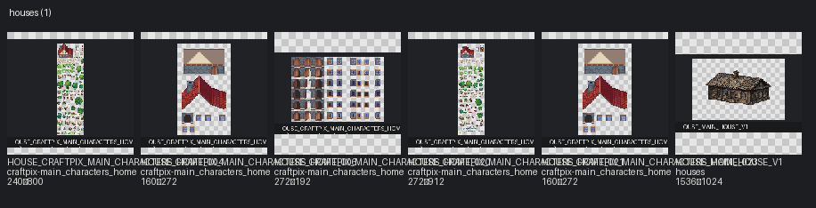
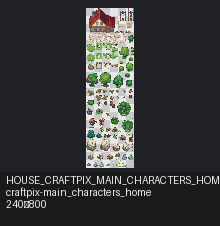
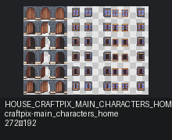
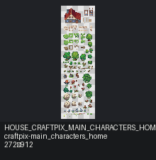
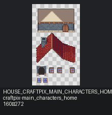
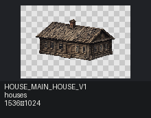

# Houses

[← START_HERE](../../START_HERE.md)

Categories: `house`, `building`

## Contact sheets

## Assets

| Asset ID | Preview | Pack | Source | Size | Alpha | Status | Tags | Notes |
|---|---|---|---|---|---|---|---|---|
| `HOUSE_CRAFTPIX_MAIN_CHARACTERS_HOME_004` |  | craftpix-main_characters_home | `assets/third_party/craftpix/main_characters_home/source/PNG/exterior.png` | 240×800 | True | needs_review | craftpix, fantasy_like, house, oversized, sprite_sheet_needs_review | Possible 16px atlas; frame groups not inferred without TSX/JSON. |
| `HOUSE_CRAFTPIX_MAIN_CHARACTERS_HOME_006` |  | craftpix-main_characters_home | `assets/third_party/craftpix/main_characters_home/source/PNG/house_details.png` | 160×272 | True | available | craftpix, house |  |
| `HOUSE_CRAFTPIX_MAIN_CHARACTERS_HOME_020` |  | craftpix-main_characters_home | `assets/third_party/craftpix/main_characters_home/source/Tiled_files/Doors_windows_animation.png` | 272×192 | True | available | craftpix, house, sprite_sheet_needs_review | Possible 16px atlas; frame groups not inferred without TSX/JSON. |
| `HOUSE_CRAFTPIX_MAIN_CHARACTERS_HOME_021` |  | craftpix-main_characters_home | `assets/third_party/craftpix/main_characters_home/source/Tiled_files/exterior.png` | 272×912 | True | needs_review | craftpix, fantasy_like, house, oversized, sprite_sheet_needs_review | Possible 16px atlas; frame groups not inferred without TSX/JSON. |
| `HOUSE_CRAFTPIX_MAIN_CHARACTERS_HOME_023` |  | craftpix-main_characters_home | `assets/third_party/craftpix/main_characters_home/source/Tiled_files/house_details.png` | 160×272 | True | available | craftpix, house |  |
| `HOUSE_MAIN_HOUSE_V1` |  | houses | `upload/houses/main_house_v1.png` | 1536×1024 | True | selected | childhood_home, house, old_russian_house, sprite_sheet_needs_review, vs01 | Утверждённый стартовый дом VS01. |
