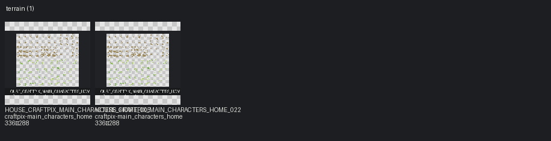
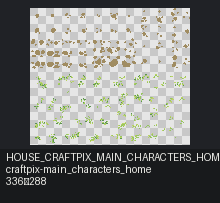

# Terrain

[← START_HERE](../../START_HERE.md)

Categories: `terrain`, `grass`, `soil`, `path`

## Contact sheets

## Assets

| Asset ID | Preview | Pack | Source | Size | Alpha | Status | Tags | Notes |
|---|---|---|---|---|---|---|---|---|
| `HOUSE_CRAFTPIX_MAIN_CHARACTERS_HOME_005` |  | craftpix-main_characters_home | `assets/third_party/craftpix/main_characters_home/source/PNG/ground_grass_details.png` | 336×288 | True | available | craftpix, grass, outdoor, sprite_sheet_needs_review, terrain | Possible 16px atlas; frame groups not inferred without TSX/JSON. |
| `HOUSE_CRAFTPIX_MAIN_CHARACTERS_HOME_022` |  | craftpix-main_characters_home | `assets/third_party/craftpix/main_characters_home/source/Tiled_files/ground_grass_details.png` | 336×288 | True | available | craftpix, grass, outdoor, sprite_sheet_needs_review, terrain | Possible 16px atlas; frame groups not inferred without TSX/JSON. |
