# Trees

[← START_HERE](../../START_HERE.md)

Categories: `tree`

## Contact sheets

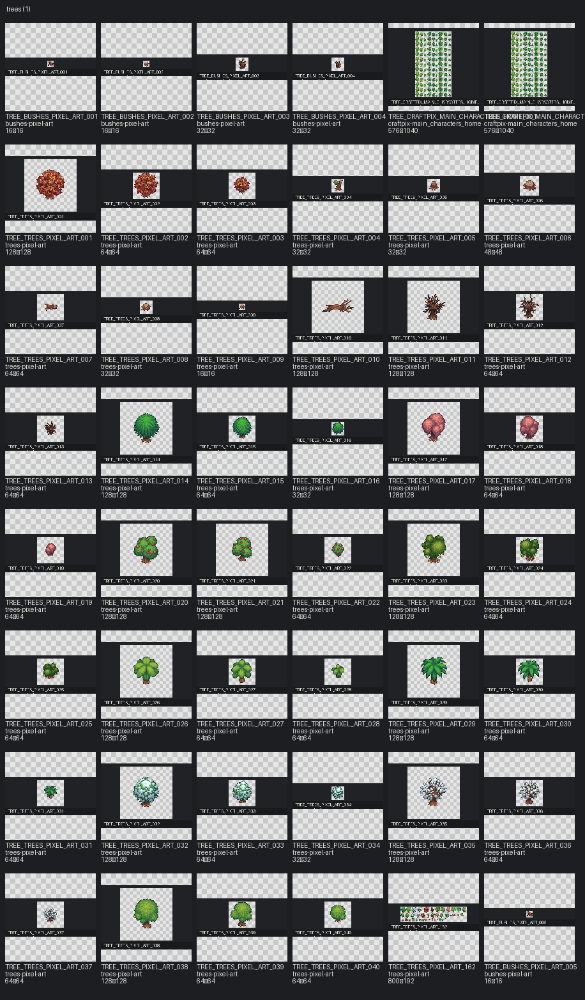

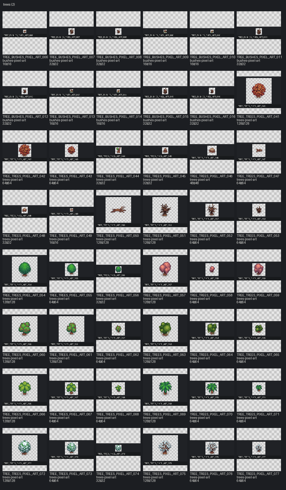

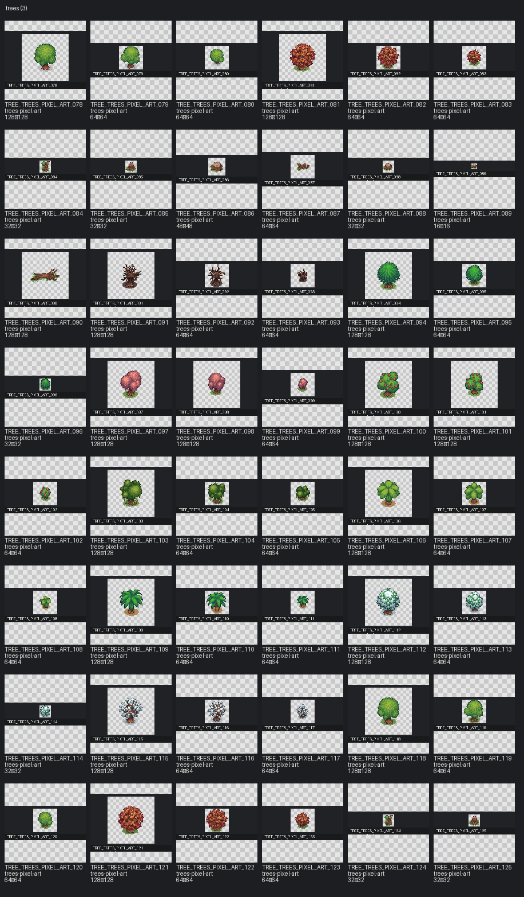

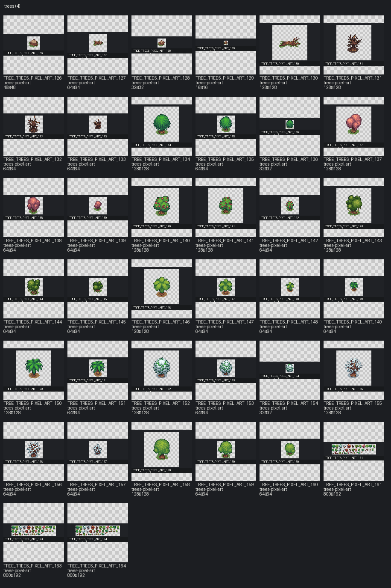

## Assets

| Asset ID | Preview | Pack | Source | Size | Alpha | Status | Tags | Notes |
|---|---|---|---|---|---|---|---|---|
| `TREE_BUSHES_PIXEL_ART_001` |  | bushes-pixel-art | `upload/bushes-pixel-art/PNG/Assets/Broken_tree1.png` | 16×16 | True | available | damaged, tree, vegetation |  |
| `TREE_BUSHES_PIXEL_ART_002` |  | bushes-pixel-art | `upload/bushes-pixel-art/PNG/Assets/Broken_tree2.png` | 16×16 | True | available | damaged, tree, vegetation |  |
| `TREE_BUSHES_PIXEL_ART_003` |  | bushes-pixel-art | `upload/bushes-pixel-art/PNG/Assets/Burned_tree1.png` | 32×32 | True | available | damaged, tree, vegetation |  |
| `TREE_BUSHES_PIXEL_ART_004` |  | bushes-pixel-art | `upload/bushes-pixel-art/PNG/Assets/Burned_tree2.png` | 32×32 | True | available | damaged, tree, vegetation |  |
| `TREE_CRAFTPIX_MAIN_CHARACTERS_HOME_001` |  | craftpix-main_characters_home | `assets/third_party/craftpix/main_characters_home/source/PNG/Trees_animation.png` | 576×1040 | True | needs_review | craftpix, fantasy_like, oversized, sprite_sheet_needs_review, tree, vegetation | Possible 16px atlas; frame groups not inferred without TSX/JSON. |
| `TREE_CRAFTPIX_MAIN_CHARACTERS_HOME_003` | 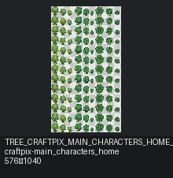 | craftpix-main_characters_home | `assets/third_party/craftpix/main_characters_home/source/Tiled_files/Trees_animation.png` | 576×1040 | True | needs_review | craftpix, fantasy_like, oversized, sprite_sheet_needs_review, tree, vegetation | Possible 16px atlas; frame groups not inferred without TSX/JSON. |
| `TREE_TREES_PIXEL_ART_001` | 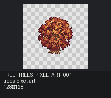 | trees-pixel-art | `upload/trees-pixel-art/PNG/Assets_separately/Trees/Autumn_tree1.png` | 128×128 | True | available | autumn, tree, vegetation |  |
| `TREE_TREES_PIXEL_ART_002` | 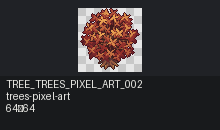 | trees-pixel-art | `upload/trees-pixel-art/PNG/Assets_separately/Trees/Autumn_tree2.png` | 64×64 | True | available | autumn, tree, vegetation |  |
| `TREE_TREES_PIXEL_ART_003` | 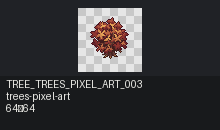 | trees-pixel-art | `upload/trees-pixel-art/PNG/Assets_separately/Trees/Autumn_tree3.png` | 64×64 | True | available | autumn, tree, vegetation |  |
| `TREE_TREES_PIXEL_ART_004` |  | trees-pixel-art | `upload/trees-pixel-art/PNG/Assets_separately/Trees/Broken_tree1.png` | 32×32 | True | available | damaged, tree, vegetation |  |
| `TREE_TREES_PIXEL_ART_005` |  | trees-pixel-art | `upload/trees-pixel-art/PNG/Assets_separately/Trees/Broken_tree2.png` | 32×32 | True | available | damaged, tree, vegetation |  |
| `TREE_TREES_PIXEL_ART_006` | 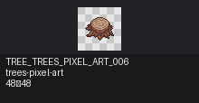 | trees-pixel-art | `upload/trees-pixel-art/PNG/Assets_separately/Trees/Broken_tree3.png` | 48×48 | True | available | damaged, tree, vegetation |  |
| `TREE_TREES_PIXEL_ART_007` | 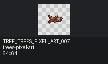 | trees-pixel-art | `upload/trees-pixel-art/PNG/Assets_separately/Trees/Broken_tree4.png` | 64×64 | True | available | damaged, tree, vegetation |  |
| `TREE_TREES_PIXEL_ART_008` |  | trees-pixel-art | `upload/trees-pixel-art/PNG/Assets_separately/Trees/Broken_tree5.png` | 32×32 | True | available | damaged, tree, vegetation |  |
| `TREE_TREES_PIXEL_ART_009` |  | trees-pixel-art | `upload/trees-pixel-art/PNG/Assets_separately/Trees/Broken_tree6.png` | 16×16 | True | available | damaged, tree, vegetation |  |
| `TREE_TREES_PIXEL_ART_010` | 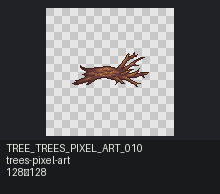 | trees-pixel-art | `upload/trees-pixel-art/PNG/Assets_separately/Trees/Broken_tree7.png` | 128×128 | True | available | damaged, tree, vegetation |  |
| `TREE_TREES_PIXEL_ART_011` | 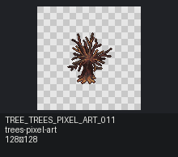 | trees-pixel-art | `upload/trees-pixel-art/PNG/Assets_separately/Trees/Burned_tree1.png` | 128×128 | True | available | damaged, tree, vegetation |  |
| `TREE_TREES_PIXEL_ART_012` | 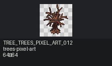 | trees-pixel-art | `upload/trees-pixel-art/PNG/Assets_separately/Trees/Burned_tree2.png` | 64×64 | True | available | damaged, tree, vegetation |  |
| `TREE_TREES_PIXEL_ART_013` | 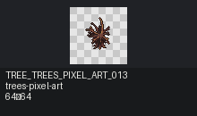 | trees-pixel-art | `upload/trees-pixel-art/PNG/Assets_separately/Trees/Burned_tree3.png` | 64×64 | True | available | damaged, tree, vegetation |  |
| `TREE_TREES_PIXEL_ART_014` | 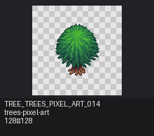 | trees-pixel-art | `upload/trees-pixel-art/PNG/Assets_separately/Trees/Christmas_tree1.png` | 128×128 | True | available | tree, vegetation, winter |  |
| `TREE_TREES_PIXEL_ART_015` | 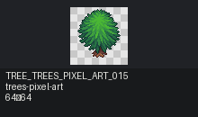 | trees-pixel-art | `upload/trees-pixel-art/PNG/Assets_separately/Trees/Christmas_tree2.png` | 64×64 | True | available | tree, vegetation, winter |  |
| `TREE_TREES_PIXEL_ART_016` |  | trees-pixel-art | `upload/trees-pixel-art/PNG/Assets_separately/Trees/Christmas_tree3.png` | 32×32 | True | available | tree, vegetation, winter |  |
| `TREE_TREES_PIXEL_ART_017` | 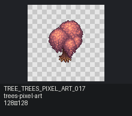 | trees-pixel-art | `upload/trees-pixel-art/PNG/Assets_separately/Trees/Flower_tree1.png` | 128×128 | True | available | tree, vegetation |  |
| `TREE_TREES_PIXEL_ART_018` | 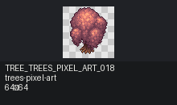 | trees-pixel-art | `upload/trees-pixel-art/PNG/Assets_separately/Trees/Flower_tree2.png` | 64×64 | True | available | tree, vegetation |  |
| `TREE_TREES_PIXEL_ART_019` | 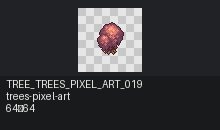 | trees-pixel-art | `upload/trees-pixel-art/PNG/Assets_separately/Trees/Flower_tree3.png` | 64×64 | True | available | tree, vegetation |  |
| `TREE_TREES_PIXEL_ART_020` | 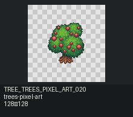 | trees-pixel-art | `upload/trees-pixel-art/PNG/Assets_separately/Trees/Fruit_tree1.png` | 128×128 | True | available | tree, vegetation |  |
| `TREE_TREES_PIXEL_ART_021` | 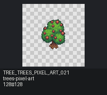 | trees-pixel-art | `upload/trees-pixel-art/PNG/Assets_separately/Trees/Fruit_tree2.png` | 128×128 | True | available | tree, vegetation |  |
| `TREE_TREES_PIXEL_ART_022` | 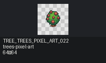 | trees-pixel-art | `upload/trees-pixel-art/PNG/Assets_separately/Trees/Fruit_tree3.png` | 64×64 | True | available | tree, vegetation |  |
| `TREE_TREES_PIXEL_ART_023` | 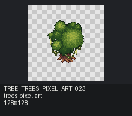 | trees-pixel-art | `upload/trees-pixel-art/PNG/Assets_separately/Trees/Moss_tree1.png` | 128×128 | True | available | tree, vegetation |  |
| `TREE_TREES_PIXEL_ART_024` | 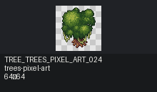 | trees-pixel-art | `upload/trees-pixel-art/PNG/Assets_separately/Trees/Moss_tree2.png` | 64×64 | True | available | tree, vegetation |  |
| `TREE_TREES_PIXEL_ART_025` | 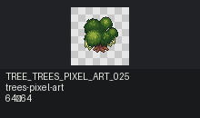 | trees-pixel-art | `upload/trees-pixel-art/PNG/Assets_separately/Trees/Moss_tree3.png` | 64×64 | True | available | tree, vegetation |  |
| `TREE_TREES_PIXEL_ART_026` | 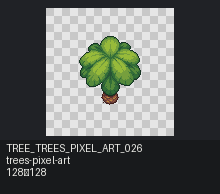 | trees-pixel-art | `upload/trees-pixel-art/PNG/Assets_separately/Trees/Palm_tree1_1.png` | 128×128 | True | available | tree, vegetation |  |
| `TREE_TREES_PIXEL_ART_027` | 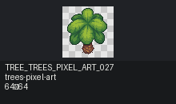 | trees-pixel-art | `upload/trees-pixel-art/PNG/Assets_separately/Trees/Palm_tree1_2.png` | 64×64 | True | available | tree, vegetation |  |
| `TREE_TREES_PIXEL_ART_028` | 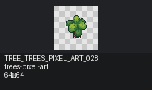 | trees-pixel-art | `upload/trees-pixel-art/PNG/Assets_separately/Trees/Palm_tree1_3.png` | 64×64 | True | available | tree, vegetation |  |
| `TREE_TREES_PIXEL_ART_029` | 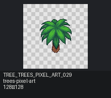 | trees-pixel-art | `upload/trees-pixel-art/PNG/Assets_separately/Trees/Palm_tree2_1.png` | 128×128 | True | available | tree, vegetation |  |
| `TREE_TREES_PIXEL_ART_030` |  | trees-pixel-art | `upload/trees-pixel-art/PNG/Assets_separately/Trees/Palm_tree2_2.png` | 64×64 | True | available | tree, vegetation |  |
| `TREE_TREES_PIXEL_ART_031` |  | trees-pixel-art | `upload/trees-pixel-art/PNG/Assets_separately/Trees/Palm_tree2_3.png` | 64×64 | True | available | tree, vegetation |  |
| `TREE_TREES_PIXEL_ART_032` | 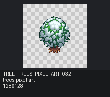 | trees-pixel-art | `upload/trees-pixel-art/PNG/Assets_separately/Trees/Snow_christmass_tree1.png` | 128×128 | True | available | tree, vegetation, winter |  |
| `TREE_TREES_PIXEL_ART_033` | 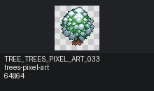 | trees-pixel-art | `upload/trees-pixel-art/PNG/Assets_separately/Trees/Snow_christmass_tree2.png` | 64×64 | True | available | tree, vegetation, winter |  |
| `TREE_TREES_PIXEL_ART_034` |  | trees-pixel-art | `upload/trees-pixel-art/PNG/Assets_separately/Trees/Snow_christmass_tree3.png` | 32×32 | True | available | tree, vegetation, winter |  |
| `TREE_TREES_PIXEL_ART_035` | 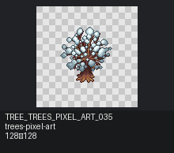 | trees-pixel-art | `upload/trees-pixel-art/PNG/Assets_separately/Trees/Snow_tree1.png` | 128×128 | True | available | tree, vegetation |  |
| `TREE_TREES_PIXEL_ART_036` | 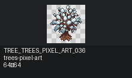 | trees-pixel-art | `upload/trees-pixel-art/PNG/Assets_separately/Trees/Snow_tree2.png` | 64×64 | True | available | tree, vegetation |  |
| `TREE_TREES_PIXEL_ART_037` | 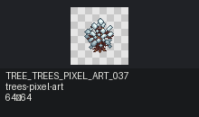 | trees-pixel-art | `upload/trees-pixel-art/PNG/Assets_separately/Trees/Snow_tree3.png` | 64×64 | True | available | tree, vegetation |  |
| `TREE_TREES_PIXEL_ART_038` | 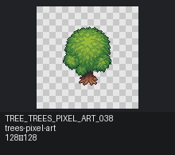 | trees-pixel-art | `upload/trees-pixel-art/PNG/Assets_separately/Trees/Tree1.png` | 128×128 | True | available | tree, vegetation |  |
| `TREE_TREES_PIXEL_ART_039` | 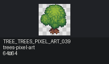 | trees-pixel-art | `upload/trees-pixel-art/PNG/Assets_separately/Trees/Tree2.png` | 64×64 | True | available | tree, vegetation |  |
| `TREE_TREES_PIXEL_ART_040` | 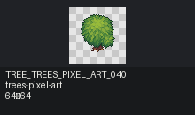 | trees-pixel-art | `upload/trees-pixel-art/PNG/Assets_separately/Trees/Tree3.png` | 64×64 | True | available | tree, vegetation |  |
| `TREE_TREES_PIXEL_ART_162` | 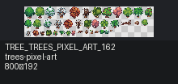 | trees-pixel-art | `upload/trees-pixel-art/PNG/Trees_source.png` | 800×192 | True | available | oversized, sprite_sheet_needs_review, tree, vegetation | Possible 16px atlas; frame groups not inferred without TSX/JSON. |
| `TREE_BUSHES_PIXEL_ART_005` |  | bushes-pixel-art | `upload/bushes-pixel-art/PNG/Assets_shadow/Broken_tree1.png` | 16×16 | True | available | damaged, shadow, tree, vegetation |  |
| `TREE_BUSHES_PIXEL_ART_006` |  | bushes-pixel-art | `upload/bushes-pixel-art/PNG/Assets_shadow/Broken_tree2.png` | 16×16 | True | available | damaged, shadow, tree, vegetation |  |
| `TREE_BUSHES_PIXEL_ART_007` |  | bushes-pixel-art | `upload/bushes-pixel-art/PNG/Assets_shadow/Burned_tree1.png` | 32×32 | True | available | damaged, shadow, tree, vegetation |  |
| `TREE_BUSHES_PIXEL_ART_008` |  | bushes-pixel-art | `upload/bushes-pixel-art/PNG/Assets_shadow/Burned_tree2.png` | 32×32 | True | available | damaged, shadow, tree, vegetation |  |
| `TREE_BUSHES_PIXEL_ART_009` |  | bushes-pixel-art | `upload/bushes-pixel-art/PNG/Assets_texture_shadow/Broken_tree1.png` | 16×16 | True | available | damaged, shadow, texture_shadow, tree, vegetation |  |
| `TREE_BUSHES_PIXEL_ART_010` |  | bushes-pixel-art | `upload/bushes-pixel-art/PNG/Assets_texture_shadow/Broken_tree2.png` | 16×16 | True | available | damaged, shadow, texture_shadow, tree, vegetation |  |
| `TREE_BUSHES_PIXEL_ART_011` |  | bushes-pixel-art | `upload/bushes-pixel-art/PNG/Assets_texture_shadow/Burned_tree1.png` | 32×32 | True | available | damaged, shadow, texture_shadow, tree, vegetation |  |
| `TREE_BUSHES_PIXEL_ART_012` |  | bushes-pixel-art | `upload/bushes-pixel-art/PNG/Assets_texture_shadow/Burned_tree2.png` | 32×32 | True | available | damaged, shadow, texture_shadow, tree, vegetation |  |
| `TREE_BUSHES_PIXEL_ART_013` |  | bushes-pixel-art | `upload/bushes-pixel-art/PNG/Assets_texture_shadow_dark/Broken_tree1.png` | 16×16 | True | available | damaged, shadow, texture_shadow, tree, vegetation |  |
| `TREE_BUSHES_PIXEL_ART_014` |  | bushes-pixel-art | `upload/bushes-pixel-art/PNG/Assets_texture_shadow_dark/Broken_tree2.png` | 16×16 | True | available | damaged, shadow, texture_shadow, tree, vegetation |  |
| `TREE_BUSHES_PIXEL_ART_015` |  | bushes-pixel-art | `upload/bushes-pixel-art/PNG/Assets_texture_shadow_dark/Burned_tree1.png` | 32×32 | True | available | damaged, shadow, texture_shadow, tree, vegetation |  |
| `TREE_BUSHES_PIXEL_ART_016` |  | bushes-pixel-art | `upload/bushes-pixel-art/PNG/Assets_texture_shadow_dark/Burned_tree2.png` | 32×32 | True | available | damaged, shadow, texture_shadow, tree, vegetation |  |
| `TREE_TREES_PIXEL_ART_041` | 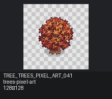 | trees-pixel-art | `upload/trees-pixel-art/PNG/Assets_separately/Trees_shadow/Autumn_tree1.png` | 128×128 | True | available | autumn, shadow, tree, vegetation |  |
| `TREE_TREES_PIXEL_ART_042` | 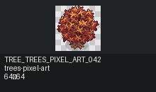 | trees-pixel-art | `upload/trees-pixel-art/PNG/Assets_separately/Trees_shadow/Autumn_tree2.png` | 64×64 | True | available | autumn, shadow, tree, vegetation |  |
| `TREE_TREES_PIXEL_ART_043` | 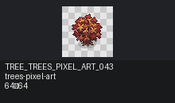 | trees-pixel-art | `upload/trees-pixel-art/PNG/Assets_separately/Trees_shadow/Autumn_tree3.png` | 64×64 | True | available | autumn, shadow, tree, vegetation |  |
| `TREE_TREES_PIXEL_ART_044` |  | trees-pixel-art | `upload/trees-pixel-art/PNG/Assets_separately/Trees_shadow/Broken_tree1.png` | 32×32 | True | available | damaged, shadow, tree, vegetation |  |
| `TREE_TREES_PIXEL_ART_045` |  | trees-pixel-art | `upload/trees-pixel-art/PNG/Assets_separately/Trees_shadow/Broken_tree2.png` | 32×32 | True | available | damaged, shadow, tree, vegetation |  |
| `TREE_TREES_PIXEL_ART_046` | 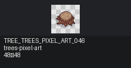 | trees-pixel-art | `upload/trees-pixel-art/PNG/Assets_separately/Trees_shadow/Broken_tree3.png` | 48×48 | True | available | damaged, shadow, tree, vegetation |  |
| `TREE_TREES_PIXEL_ART_047` | 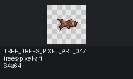 | trees-pixel-art | `upload/trees-pixel-art/PNG/Assets_separately/Trees_shadow/Broken_tree4.png` | 64×64 | True | available | damaged, shadow, tree, vegetation |  |
| `TREE_TREES_PIXEL_ART_048` |  | trees-pixel-art | `upload/trees-pixel-art/PNG/Assets_separately/Trees_shadow/Broken_tree5.png` | 32×32 | True | available | damaged, shadow, tree, vegetation |  |
| `TREE_TREES_PIXEL_ART_049` |  | trees-pixel-art | `upload/trees-pixel-art/PNG/Assets_separately/Trees_shadow/Broken_tree6.png` | 16×16 | True | available | damaged, shadow, tree, vegetation |  |
| `TREE_TREES_PIXEL_ART_050` | 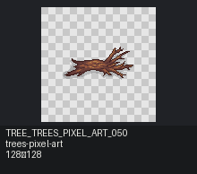 | trees-pixel-art | `upload/trees-pixel-art/PNG/Assets_separately/Trees_shadow/Broken_tree7.png` | 128×128 | True | available | damaged, shadow, tree, vegetation |  |
| `TREE_TREES_PIXEL_ART_051` | 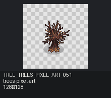 | trees-pixel-art | `upload/trees-pixel-art/PNG/Assets_separately/Trees_shadow/Burned_tree1.png` | 128×128 | True | available | damaged, shadow, tree, vegetation |  |
| `TREE_TREES_PIXEL_ART_052` | 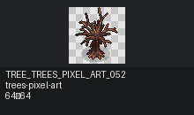 | trees-pixel-art | `upload/trees-pixel-art/PNG/Assets_separately/Trees_shadow/Burned_tree2.png` | 64×64 | True | available | damaged, shadow, tree, vegetation |  |
| `TREE_TREES_PIXEL_ART_053` | 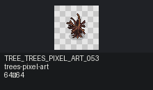 | trees-pixel-art | `upload/trees-pixel-art/PNG/Assets_separately/Trees_shadow/Burned_tree3.png` | 64×64 | True | available | damaged, shadow, tree, vegetation |  |
| `TREE_TREES_PIXEL_ART_054` | 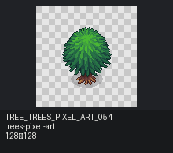 | trees-pixel-art | `upload/trees-pixel-art/PNG/Assets_separately/Trees_shadow/Christmas_tree1.png` | 128×128 | True | available | shadow, tree, vegetation, winter |  |
| `TREE_TREES_PIXEL_ART_055` | 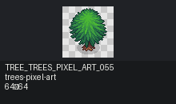 | trees-pixel-art | `upload/trees-pixel-art/PNG/Assets_separately/Trees_shadow/Christmas_tree2.png` | 64×64 | True | available | shadow, tree, vegetation, winter |  |
| `TREE_TREES_PIXEL_ART_056` |  | trees-pixel-art | `upload/trees-pixel-art/PNG/Assets_separately/Trees_shadow/Christmas_tree3.png` | 32×32 | True | available | shadow, tree, vegetation, winter |  |
| `TREE_TREES_PIXEL_ART_057` | 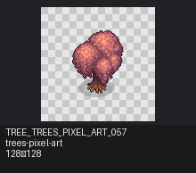 | trees-pixel-art | `upload/trees-pixel-art/PNG/Assets_separately/Trees_shadow/Flower_tree1.png` | 128×128 | True | available | shadow, tree, vegetation |  |
| `TREE_TREES_PIXEL_ART_058` |  | trees-pixel-art | `upload/trees-pixel-art/PNG/Assets_separately/Trees_shadow/Flower_tree2-1.png` | 64×64 | True | available | shadow, tree, vegetation |  |
| `TREE_TREES_PIXEL_ART_059` |  | trees-pixel-art | `upload/trees-pixel-art/PNG/Assets_separately/Trees_shadow/Flower_tree2.png` | 64×64 | True | available | shadow, tree, vegetation |  |
| `TREE_TREES_PIXEL_ART_060` |  | trees-pixel-art | `upload/trees-pixel-art/PNG/Assets_separately/Trees_shadow/Fruit_tree1.png` | 128×128 | True | available | shadow, tree, vegetation |  |
| `TREE_TREES_PIXEL_ART_061` |  | trees-pixel-art | `upload/trees-pixel-art/PNG/Assets_separately/Trees_shadow/Fruit_tree2.png` | 128×128 | True | available | shadow, tree, vegetation |  |
| `TREE_TREES_PIXEL_ART_062` |  | trees-pixel-art | `upload/trees-pixel-art/PNG/Assets_separately/Trees_shadow/Fruit_tree3.png` | 64×64 | True | available | shadow, tree, vegetation |  |
| `TREE_TREES_PIXEL_ART_063` |  | trees-pixel-art | `upload/trees-pixel-art/PNG/Assets_separately/Trees_shadow/Moss_tree1.png` | 128×128 | True | available | shadow, tree, vegetation |  |
| `TREE_TREES_PIXEL_ART_064` |  | trees-pixel-art | `upload/trees-pixel-art/PNG/Assets_separately/Trees_shadow/Moss_tree2.png` | 64×64 | True | available | shadow, tree, vegetation |  |
| `TREE_TREES_PIXEL_ART_065` |  | trees-pixel-art | `upload/trees-pixel-art/PNG/Assets_separately/Trees_shadow/Moss_tree3.png` | 64×64 | True | available | shadow, tree, vegetation |  |
| `TREE_TREES_PIXEL_ART_066` |  | trees-pixel-art | `upload/trees-pixel-art/PNG/Assets_separately/Trees_shadow/Palm_tree1_1.png` | 128×128 | True | available | shadow, tree, vegetation |  |
| `TREE_TREES_PIXEL_ART_067` |  | trees-pixel-art | `upload/trees-pixel-art/PNG/Assets_separately/Trees_shadow/Palm_tree1_2.png` | 64×64 | True | available | shadow, tree, vegetation |  |
| `TREE_TREES_PIXEL_ART_068` |  | trees-pixel-art | `upload/trees-pixel-art/PNG/Assets_separately/Trees_shadow/Palm_tree1_3.png` | 64×64 | True | available | shadow, tree, vegetation |  |
| `TREE_TREES_PIXEL_ART_069` |  | trees-pixel-art | `upload/trees-pixel-art/PNG/Assets_separately/Trees_shadow/Palm_tree2_1.png` | 128×128 | True | available | shadow, tree, vegetation |  |
| `TREE_TREES_PIXEL_ART_070` |  | trees-pixel-art | `upload/trees-pixel-art/PNG/Assets_separately/Trees_shadow/Palm_tree2_2.png` | 64×64 | True | available | shadow, tree, vegetation |  |
| `TREE_TREES_PIXEL_ART_071` |  | trees-pixel-art | `upload/trees-pixel-art/PNG/Assets_separately/Trees_shadow/Palm_tree2_3.png` | 64×64 | True | available | shadow, tree, vegetation |  |
| `TREE_TREES_PIXEL_ART_072` |  | trees-pixel-art | `upload/trees-pixel-art/PNG/Assets_separately/Trees_shadow/Snow_christmass_tree1.png` | 128×128 | True | available | shadow, tree, vegetation, winter |  |
| `TREE_TREES_PIXEL_ART_073` |  | trees-pixel-art | `upload/trees-pixel-art/PNG/Assets_separately/Trees_shadow/Snow_christmass_tree2.png` | 64×64 | True | available | shadow, tree, vegetation, winter |  |
| `TREE_TREES_PIXEL_ART_074` |  | trees-pixel-art | `upload/trees-pixel-art/PNG/Assets_separately/Trees_shadow/Snow_christmass_tree3.png` | 32×32 | True | available | shadow, tree, vegetation, winter |  |
| `TREE_TREES_PIXEL_ART_075` |  | trees-pixel-art | `upload/trees-pixel-art/PNG/Assets_separately/Trees_shadow/Snow_tree1.png` | 128×128 | True | available | shadow, tree, vegetation |  |
| `TREE_TREES_PIXEL_ART_076` |  | trees-pixel-art | `upload/trees-pixel-art/PNG/Assets_separately/Trees_shadow/Snow_tree2.png` | 64×64 | True | available | shadow, tree, vegetation |  |
| `TREE_TREES_PIXEL_ART_077` |  | trees-pixel-art | `upload/trees-pixel-art/PNG/Assets_separately/Trees_shadow/Snow_tree3.png` | 64×64 | True | available | shadow, tree, vegetation |  |
| `TREE_TREES_PIXEL_ART_078` |  | trees-pixel-art | `upload/trees-pixel-art/PNG/Assets_separately/Trees_shadow/Tree1.png` | 128×128 | True | available | shadow, tree, vegetation |  |
| `TREE_TREES_PIXEL_ART_079` |  | trees-pixel-art | `upload/trees-pixel-art/PNG/Assets_separately/Trees_shadow/Tree2.png` | 64×64 | True | available | shadow, tree, vegetation |  |
| `TREE_TREES_PIXEL_ART_080` |  | trees-pixel-art | `upload/trees-pixel-art/PNG/Assets_separately/Trees_shadow/Tree3.png` | 64×64 | True | available | shadow, tree, vegetation |  |
| `TREE_TREES_PIXEL_ART_081` |  | trees-pixel-art | `upload/trees-pixel-art/PNG/Assets_separately/Trees_texture_shadow/Autumn_tree1.png` | 128×128 | True | available | autumn, shadow, texture_shadow, tree, vegetation |  |
| `TREE_TREES_PIXEL_ART_082` |  | trees-pixel-art | `upload/trees-pixel-art/PNG/Assets_separately/Trees_texture_shadow/Autumn_tree2.png` | 64×64 | True | available | autumn, shadow, texture_shadow, tree, vegetation |  |
| `TREE_TREES_PIXEL_ART_083` |  | trees-pixel-art | `upload/trees-pixel-art/PNG/Assets_separately/Trees_texture_shadow/Autumn_tree3.png` | 64×64 | True | available | autumn, shadow, texture_shadow, tree, vegetation |  |
| `TREE_TREES_PIXEL_ART_084` |  | trees-pixel-art | `upload/trees-pixel-art/PNG/Assets_separately/Trees_texture_shadow/Broken_tree1.png` | 32×32 | True | available | damaged, shadow, texture_shadow, tree, vegetation |  |
| `TREE_TREES_PIXEL_ART_085` |  | trees-pixel-art | `upload/trees-pixel-art/PNG/Assets_separately/Trees_texture_shadow/Broken_tree2.png` | 32×32 | True | available | damaged, shadow, texture_shadow, tree, vegetation |  |
| `TREE_TREES_PIXEL_ART_086` |  | trees-pixel-art | `upload/trees-pixel-art/PNG/Assets_separately/Trees_texture_shadow/Broken_tree3.png` | 48×48 | True | available | damaged, shadow, texture_shadow, tree, vegetation |  |
| `TREE_TREES_PIXEL_ART_087` |  | trees-pixel-art | `upload/trees-pixel-art/PNG/Assets_separately/Trees_texture_shadow/Broken_tree4.png` | 64×64 | True | available | damaged, shadow, texture_shadow, tree, vegetation |  |
| `TREE_TREES_PIXEL_ART_088` |  | trees-pixel-art | `upload/trees-pixel-art/PNG/Assets_separately/Trees_texture_shadow/Broken_tree5.png` | 32×32 | True | available | damaged, shadow, texture_shadow, tree, vegetation |  |
| `TREE_TREES_PIXEL_ART_089` |  | trees-pixel-art | `upload/trees-pixel-art/PNG/Assets_separately/Trees_texture_shadow/Broken_tree6.png` | 16×16 | True | available | damaged, shadow, texture_shadow, tree, vegetation |  |
| `TREE_TREES_PIXEL_ART_090` |  | trees-pixel-art | `upload/trees-pixel-art/PNG/Assets_separately/Trees_texture_shadow/Broken_tree7.png` | 128×128 | True | available | damaged, shadow, texture_shadow, tree, vegetation |  |
| `TREE_TREES_PIXEL_ART_091` |  | trees-pixel-art | `upload/trees-pixel-art/PNG/Assets_separately/Trees_texture_shadow/Burned_tree1.png` | 128×128 | True | available | damaged, shadow, texture_shadow, tree, vegetation |  |
| `TREE_TREES_PIXEL_ART_092` |  | trees-pixel-art | `upload/trees-pixel-art/PNG/Assets_separately/Trees_texture_shadow/Burned_tree2.png` | 64×64 | True | available | damaged, shadow, texture_shadow, tree, vegetation |  |
| `TREE_TREES_PIXEL_ART_093` |  | trees-pixel-art | `upload/trees-pixel-art/PNG/Assets_separately/Trees_texture_shadow/Burned_tree3.png` | 64×64 | True | available | damaged, shadow, texture_shadow, tree, vegetation |  |
| `TREE_TREES_PIXEL_ART_094` |  | trees-pixel-art | `upload/trees-pixel-art/PNG/Assets_separately/Trees_texture_shadow/Christmas_tree1.png` | 128×128 | True | available | shadow, texture_shadow, tree, vegetation, winter |  |
| `TREE_TREES_PIXEL_ART_095` |  | trees-pixel-art | `upload/trees-pixel-art/PNG/Assets_separately/Trees_texture_shadow/Christmas_tree2.png` | 64×64 | True | available | shadow, texture_shadow, tree, vegetation, winter |  |
| `TREE_TREES_PIXEL_ART_096` |  | trees-pixel-art | `upload/trees-pixel-art/PNG/Assets_separately/Trees_texture_shadow/Christmas_tree3.png` | 32×32 | True | available | shadow, texture_shadow, tree, vegetation, winter |  |
| `TREE_TREES_PIXEL_ART_097` |  | trees-pixel-art | `upload/trees-pixel-art/PNG/Assets_separately/Trees_texture_shadow/Flower_tree1.png` | 128×128 | True | available | shadow, texture_shadow, tree, vegetation |  |
| `TREE_TREES_PIXEL_ART_098` |  | trees-pixel-art | `upload/trees-pixel-art/PNG/Assets_separately/Trees_texture_shadow/Flower_tree2.png` | 128×128 | True | available | shadow, texture_shadow, tree, vegetation |  |
| `TREE_TREES_PIXEL_ART_099` |  | trees-pixel-art | `upload/trees-pixel-art/PNG/Assets_separately/Trees_texture_shadow/Flower_tree3.png` | 64×64 | True | available | shadow, texture_shadow, tree, vegetation |  |
| `TREE_TREES_PIXEL_ART_100` |  | trees-pixel-art | `upload/trees-pixel-art/PNG/Assets_separately/Trees_texture_shadow/Fruit_tree1.png` | 128×128 | True | available | shadow, texture_shadow, tree, vegetation |  |
| `TREE_TREES_PIXEL_ART_101` |  | trees-pixel-art | `upload/trees-pixel-art/PNG/Assets_separately/Trees_texture_shadow/Fruit_tree2.png` | 128×128 | True | available | shadow, texture_shadow, tree, vegetation |  |
| `TREE_TREES_PIXEL_ART_102` |  | trees-pixel-art | `upload/trees-pixel-art/PNG/Assets_separately/Trees_texture_shadow/Fruit_tree3.png` | 64×64 | True | available | shadow, texture_shadow, tree, vegetation |  |
| `TREE_TREES_PIXEL_ART_103` |  | trees-pixel-art | `upload/trees-pixel-art/PNG/Assets_separately/Trees_texture_shadow/Moss_tree1.png` | 128×128 | True | available | shadow, texture_shadow, tree, vegetation |  |
| `TREE_TREES_PIXEL_ART_104` |  | trees-pixel-art | `upload/trees-pixel-art/PNG/Assets_separately/Trees_texture_shadow/Moss_tree2.png` | 64×64 | True | available | shadow, texture_shadow, tree, vegetation |  |
| `TREE_TREES_PIXEL_ART_105` |  | trees-pixel-art | `upload/trees-pixel-art/PNG/Assets_separately/Trees_texture_shadow/Moss_tree3.png` | 64×64 | True | available | shadow, texture_shadow, tree, vegetation |  |
| `TREE_TREES_PIXEL_ART_106` |  | trees-pixel-art | `upload/trees-pixel-art/PNG/Assets_separately/Trees_texture_shadow/Palm_tree1_1.png` | 128×128 | True | available | shadow, texture_shadow, tree, vegetation |  |
| `TREE_TREES_PIXEL_ART_107` |  | trees-pixel-art | `upload/trees-pixel-art/PNG/Assets_separately/Trees_texture_shadow/Palm_tree1_2.png` | 64×64 | True | available | shadow, texture_shadow, tree, vegetation |  |
| `TREE_TREES_PIXEL_ART_108` |  | trees-pixel-art | `upload/trees-pixel-art/PNG/Assets_separately/Trees_texture_shadow/Palm_tree1_3.png` | 64×64 | True | available | shadow, texture_shadow, tree, vegetation |  |
| `TREE_TREES_PIXEL_ART_109` |  | trees-pixel-art | `upload/trees-pixel-art/PNG/Assets_separately/Trees_texture_shadow/Palm_tree2_1.png` | 128×128 | True | available | shadow, texture_shadow, tree, vegetation |  |
| `TREE_TREES_PIXEL_ART_110` |  | trees-pixel-art | `upload/trees-pixel-art/PNG/Assets_separately/Trees_texture_shadow/Palm_tree2_2.png` | 64×64 | True | available | shadow, texture_shadow, tree, vegetation |  |
| `TREE_TREES_PIXEL_ART_111` |  | trees-pixel-art | `upload/trees-pixel-art/PNG/Assets_separately/Trees_texture_shadow/Palm_tree2_3.png` | 64×64 | True | available | shadow, texture_shadow, tree, vegetation |  |
| `TREE_TREES_PIXEL_ART_112` |  | trees-pixel-art | `upload/trees-pixel-art/PNG/Assets_separately/Trees_texture_shadow/Snow_christmass_tree1.png` | 128×128 | True | available | shadow, texture_shadow, tree, vegetation, winter |  |
| `TREE_TREES_PIXEL_ART_113` |  | trees-pixel-art | `upload/trees-pixel-art/PNG/Assets_separately/Trees_texture_shadow/Snow_christmass_tree2.png` | 64×64 | True | available | shadow, texture_shadow, tree, vegetation, winter |  |
| `TREE_TREES_PIXEL_ART_114` |  | trees-pixel-art | `upload/trees-pixel-art/PNG/Assets_separately/Trees_texture_shadow/Snow_christmass_tree3.png` | 32×32 | True | available | shadow, texture_shadow, tree, vegetation, winter |  |
| `TREE_TREES_PIXEL_ART_115` |  | trees-pixel-art | `upload/trees-pixel-art/PNG/Assets_separately/Trees_texture_shadow/Snow_tree1.png` | 128×128 | True | available | shadow, texture_shadow, tree, vegetation |  |
| `TREE_TREES_PIXEL_ART_116` |  | trees-pixel-art | `upload/trees-pixel-art/PNG/Assets_separately/Trees_texture_shadow/Snow_tree2.png` | 64×64 | True | available | shadow, texture_shadow, tree, vegetation |  |
| `TREE_TREES_PIXEL_ART_117` |  | trees-pixel-art | `upload/trees-pixel-art/PNG/Assets_separately/Trees_texture_shadow/Snow_tree3.png` | 64×64 | True | available | shadow, texture_shadow, tree, vegetation |  |
| `TREE_TREES_PIXEL_ART_118` |  | trees-pixel-art | `upload/trees-pixel-art/PNG/Assets_separately/Trees_texture_shadow/Tree1.png` | 128×128 | True | available | shadow, texture_shadow, tree, vegetation |  |
| `TREE_TREES_PIXEL_ART_119` |  | trees-pixel-art | `upload/trees-pixel-art/PNG/Assets_separately/Trees_texture_shadow/Tree2.png` | 64×64 | True | available | shadow, texture_shadow, tree, vegetation |  |
| `TREE_TREES_PIXEL_ART_120` |  | trees-pixel-art | `upload/trees-pixel-art/PNG/Assets_separately/Trees_texture_shadow/Tree3.png` | 64×64 | True | available | shadow, texture_shadow, tree, vegetation |  |
| `TREE_TREES_PIXEL_ART_121` |  | trees-pixel-art | `upload/trees-pixel-art/PNG/Assets_separately/Trees_texture_shadow_dark/Autumn_tree1.png` | 128×128 | True | available | autumn, shadow, texture_shadow, tree, vegetation |  |
| `TREE_TREES_PIXEL_ART_122` |  | trees-pixel-art | `upload/trees-pixel-art/PNG/Assets_separately/Trees_texture_shadow_dark/Autumn_tree2.png` | 64×64 | True | available | autumn, shadow, texture_shadow, tree, vegetation |  |
| `TREE_TREES_PIXEL_ART_123` |  | trees-pixel-art | `upload/trees-pixel-art/PNG/Assets_separately/Trees_texture_shadow_dark/Autumn_tree3.png` | 64×64 | True | available | autumn, shadow, texture_shadow, tree, vegetation |  |
| `TREE_TREES_PIXEL_ART_124` |  | trees-pixel-art | `upload/trees-pixel-art/PNG/Assets_separately/Trees_texture_shadow_dark/Broken_tree1.png` | 32×32 | True | available | damaged, shadow, texture_shadow, tree, vegetation |  |
| `TREE_TREES_PIXEL_ART_125` |  | trees-pixel-art | `upload/trees-pixel-art/PNG/Assets_separately/Trees_texture_shadow_dark/Broken_tree2.png` | 32×32 | True | available | damaged, shadow, texture_shadow, tree, vegetation |  |
| `TREE_TREES_PIXEL_ART_126` |  | trees-pixel-art | `upload/trees-pixel-art/PNG/Assets_separately/Trees_texture_shadow_dark/Broken_tree3.png` | 48×48 | True | available | damaged, shadow, texture_shadow, tree, vegetation |  |
| `TREE_TREES_PIXEL_ART_127` |  | trees-pixel-art | `upload/trees-pixel-art/PNG/Assets_separately/Trees_texture_shadow_dark/Broken_tree4.png` | 64×64 | True | available | damaged, shadow, texture_shadow, tree, vegetation |  |
| `TREE_TREES_PIXEL_ART_128` |  | trees-pixel-art | `upload/trees-pixel-art/PNG/Assets_separately/Trees_texture_shadow_dark/Broken_tree5.png` | 32×32 | True | available | damaged, shadow, texture_shadow, tree, vegetation |  |
| `TREE_TREES_PIXEL_ART_129` |  | trees-pixel-art | `upload/trees-pixel-art/PNG/Assets_separately/Trees_texture_shadow_dark/Broken_tree6.png` | 16×16 | True | available | damaged, shadow, texture_shadow, tree, vegetation |  |
| `TREE_TREES_PIXEL_ART_130` |  | trees-pixel-art | `upload/trees-pixel-art/PNG/Assets_separately/Trees_texture_shadow_dark/Broken_tree7.png` | 128×128 | True | available | damaged, shadow, texture_shadow, tree, vegetation |  |
| `TREE_TREES_PIXEL_ART_131` |  | trees-pixel-art | `upload/trees-pixel-art/PNG/Assets_separately/Trees_texture_shadow_dark/Burned_tree1.png` | 128×128 | True | available | damaged, shadow, texture_shadow, tree, vegetation |  |
| `TREE_TREES_PIXEL_ART_132` |  | trees-pixel-art | `upload/trees-pixel-art/PNG/Assets_separately/Trees_texture_shadow_dark/Burned_tree2.png` | 64×64 | True | available | damaged, shadow, texture_shadow, tree, vegetation |  |
| `TREE_TREES_PIXEL_ART_133` |  | trees-pixel-art | `upload/trees-pixel-art/PNG/Assets_separately/Trees_texture_shadow_dark/Burned_tree3.png` | 64×64 | True | available | damaged, shadow, texture_shadow, tree, vegetation |  |
| `TREE_TREES_PIXEL_ART_134` |  | trees-pixel-art | `upload/trees-pixel-art/PNG/Assets_separately/Trees_texture_shadow_dark/Christmas_tree1.png` | 128×128 | True | available | shadow, texture_shadow, tree, vegetation, winter |  |
| `TREE_TREES_PIXEL_ART_135` |  | trees-pixel-art | `upload/trees-pixel-art/PNG/Assets_separately/Trees_texture_shadow_dark/Christmas_tree2.png` | 64×64 | True | available | shadow, texture_shadow, tree, vegetation, winter |  |
| `TREE_TREES_PIXEL_ART_136` |  | trees-pixel-art | `upload/trees-pixel-art/PNG/Assets_separately/Trees_texture_shadow_dark/Christmas_tree3.png` | 32×32 | True | available | shadow, texture_shadow, tree, vegetation, winter |  |
| `TREE_TREES_PIXEL_ART_137` |  | trees-pixel-art | `upload/trees-pixel-art/PNG/Assets_separately/Trees_texture_shadow_dark/Flower_tree1.png` | 128×128 | True | available | shadow, texture_shadow, tree, vegetation |  |
| `TREE_TREES_PIXEL_ART_138` |  | trees-pixel-art | `upload/trees-pixel-art/PNG/Assets_separately/Trees_texture_shadow_dark/Flower_tree2.png` | 64×64 | True | available | shadow, texture_shadow, tree, vegetation |  |
| `TREE_TREES_PIXEL_ART_139` |  | trees-pixel-art | `upload/trees-pixel-art/PNG/Assets_separately/Trees_texture_shadow_dark/Flower_tree3.png` | 64×64 | True | available | shadow, texture_shadow, tree, vegetation |  |
| `TREE_TREES_PIXEL_ART_140` |  | trees-pixel-art | `upload/trees-pixel-art/PNG/Assets_separately/Trees_texture_shadow_dark/Fruit_tree1.png` | 128×128 | True | available | shadow, texture_shadow, tree, vegetation |  |
| `TREE_TREES_PIXEL_ART_141` |  | trees-pixel-art | `upload/trees-pixel-art/PNG/Assets_separately/Trees_texture_shadow_dark/Fruit_tree2.png` | 128×128 | True | available | shadow, texture_shadow, tree, vegetation |  |
| `TREE_TREES_PIXEL_ART_142` |  | trees-pixel-art | `upload/trees-pixel-art/PNG/Assets_separately/Trees_texture_shadow_dark/Fruit_tree3.png` | 64×64 | True | available | shadow, texture_shadow, tree, vegetation |  |
| `TREE_TREES_PIXEL_ART_143` |  | trees-pixel-art | `upload/trees-pixel-art/PNG/Assets_separately/Trees_texture_shadow_dark/Moss_tree1.png` | 128×128 | True | available | shadow, texture_shadow, tree, vegetation |  |
| `TREE_TREES_PIXEL_ART_144` |  | trees-pixel-art | `upload/trees-pixel-art/PNG/Assets_separately/Trees_texture_shadow_dark/Moss_tree2.png` | 64×64 | True | available | shadow, texture_shadow, tree, vegetation |  |
| `TREE_TREES_PIXEL_ART_145` |  | trees-pixel-art | `upload/trees-pixel-art/PNG/Assets_separately/Trees_texture_shadow_dark/Moss_tree3.png` | 64×64 | True | available | shadow, texture_shadow, tree, vegetation |  |
| `TREE_TREES_PIXEL_ART_146` |  | trees-pixel-art | `upload/trees-pixel-art/PNG/Assets_separately/Trees_texture_shadow_dark/Palm_tree1_1.png` | 128×128 | True | available | shadow, texture_shadow, tree, vegetation |  |
| `TREE_TREES_PIXEL_ART_147` |  | trees-pixel-art | `upload/trees-pixel-art/PNG/Assets_separately/Trees_texture_shadow_dark/Palm_tree1_2.png` | 64×64 | True | available | shadow, texture_shadow, tree, vegetation |  |
| `TREE_TREES_PIXEL_ART_148` |  | trees-pixel-art | `upload/trees-pixel-art/PNG/Assets_separately/Trees_texture_shadow_dark/Palm_tree1_3.png` | 64×64 | True | available | shadow, texture_shadow, tree, vegetation |  |
| `TREE_TREES_PIXEL_ART_149` |  | trees-pixel-art | `upload/trees-pixel-art/PNG/Assets_separately/Trees_texture_shadow_dark/Palm_tree2_.png` | 64×64 | True | available | shadow, texture_shadow, tree, vegetation |  |
| `TREE_TREES_PIXEL_ART_150` |  | trees-pixel-art | `upload/trees-pixel-art/PNG/Assets_separately/Trees_texture_shadow_dark/Palm_tree2_1.png` | 128×128 | True | available | shadow, texture_shadow, tree, vegetation |  |
| `TREE_TREES_PIXEL_ART_151` |  | trees-pixel-art | `upload/trees-pixel-art/PNG/Assets_separately/Trees_texture_shadow_dark/Palm_tree2_2.png` | 64×64 | True | available | shadow, texture_shadow, tree, vegetation |  |
| `TREE_TREES_PIXEL_ART_152` |  | trees-pixel-art | `upload/trees-pixel-art/PNG/Assets_separately/Trees_texture_shadow_dark/Snow_christmass_tree1.png` | 128×128 | True | available | shadow, texture_shadow, tree, vegetation, winter |  |
| `TREE_TREES_PIXEL_ART_153` |  | trees-pixel-art | `upload/trees-pixel-art/PNG/Assets_separately/Trees_texture_shadow_dark/Snow_christmass_tree2.png` | 64×64 | True | available | shadow, texture_shadow, tree, vegetation, winter |  |
| `TREE_TREES_PIXEL_ART_154` |  | trees-pixel-art | `upload/trees-pixel-art/PNG/Assets_separately/Trees_texture_shadow_dark/Snow_christmass_tree3.png` | 32×32 | True | available | shadow, texture_shadow, tree, vegetation, winter |  |
| `TREE_TREES_PIXEL_ART_155` |  | trees-pixel-art | `upload/trees-pixel-art/PNG/Assets_separately/Trees_texture_shadow_dark/Snow_tree1.png` | 128×128 | True | available | shadow, texture_shadow, tree, vegetation |  |
| `TREE_TREES_PIXEL_ART_156` |  | trees-pixel-art | `upload/trees-pixel-art/PNG/Assets_separately/Trees_texture_shadow_dark/Snow_tree2.png` | 64×64 | True | available | shadow, texture_shadow, tree, vegetation |  |
| `TREE_TREES_PIXEL_ART_157` |  | trees-pixel-art | `upload/trees-pixel-art/PNG/Assets_separately/Trees_texture_shadow_dark/Snow_tree3.png` | 64×64 | True | available | shadow, texture_shadow, tree, vegetation |  |
| `TREE_TREES_PIXEL_ART_158` |  | trees-pixel-art | `upload/trees-pixel-art/PNG/Assets_separately/Trees_texture_shadow_dark/Tree1.png` | 128×128 | True | available | shadow, texture_shadow, tree, vegetation |  |
| `TREE_TREES_PIXEL_ART_159` |  | trees-pixel-art | `upload/trees-pixel-art/PNG/Assets_separately/Trees_texture_shadow_dark/Tree2.png` | 64×64 | True | available | shadow, texture_shadow, tree, vegetation |  |
| `TREE_TREES_PIXEL_ART_160` |  | trees-pixel-art | `upload/trees-pixel-art/PNG/Assets_separately/Trees_texture_shadow_dark/Tree3.png` | 64×64 | True | available | shadow, texture_shadow, tree, vegetation |  |
| `TREE_TREES_PIXEL_ART_161` |  | trees-pixel-art | `upload/trees-pixel-art/PNG/Trees_shadow_source.png` | 800×192 | True | available | oversized, shadow, sprite_sheet_needs_review, tree, vegetation | Possible 16px atlas; frame groups not inferred without TSX/JSON. |
| `TREE_TREES_PIXEL_ART_163` |  | trees-pixel-art | `upload/trees-pixel-art/PNG/Trees_texture_shadow_source.png` | 800×192 | True | available | oversized, shadow, sprite_sheet_needs_review, texture_shadow, tree, vegetation | Possible 16px atlas; frame groups not inferred without TSX/JSON. |
| `TREE_TREES_PIXEL_ART_164` |  | trees-pixel-art | `upload/trees-pixel-art/PNG/Trees_texture_shadows_dark_source.png` | 800×192 | True | available | oversized, shadow, sprite_sheet_needs_review, texture_shadow, tree, vegetation | Possible 16px atlas; frame groups not inferred without TSX/JSON. |
