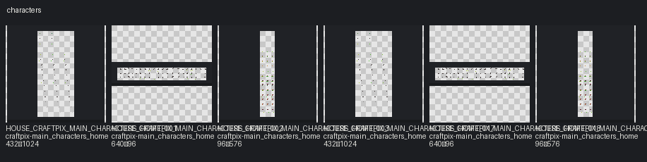

# Characters

Categories: character, animal

## Contact sheets

## Assets

| Asset ID | Pack | Source | Size | Alpha | Status | Tags | Notes |
|---|---|---|---|---|---|---|---|
| `HOUSE_CRAFTPIX_MAIN_CHARACTERS_HOME_001` | craftpix-main_characters_home | `assets/third_party/craftpix/main_characters_home/source/PNG/bird_fly_animation.png` | 432×1024 | True | available | outdoor, animal, craftpix, bird | Possible 16px atlas; frame groups not inferred without TSX/JSON. |
| `HOUSE_CRAFTPIX_MAIN_CHARACTERS_HOME_002` | craftpix-main_characters_home | `assets/third_party/craftpix/main_characters_home/source/PNG/bird_jump_animation.png` | 640×96 | True | available | outdoor, animal, craftpix, bird | Possible 16px atlas; frame groups not inferred without TSX/JSON. |
| `HOUSE_CRAFTPIX_MAIN_CHARACTERS_HOME_003` | craftpix-main_characters_home | `assets/third_party/craftpix/main_characters_home/source/PNG/cat_animation.png` | 96×576 | True | available | outdoor, animal, craftpix | Cat animation sheet — not a player character. |
| `HOUSE_CRAFTPIX_MAIN_CHARACTERS_HOME_017` | craftpix-main_characters_home | `assets/third_party/craftpix/main_characters_home/source/Tiled_files/bird_fly_animation.png` | 432×1024 | True | available | outdoor, animal, craftpix, bird | Possible 16px atlas; frame groups not inferred without TSX/JSON. |
| `HOUSE_CRAFTPIX_MAIN_CHARACTERS_HOME_018` | craftpix-main_characters_home | `assets/third_party/craftpix/main_characters_home/source/Tiled_files/bird_jump_animation.png` | 640×96 | True | available | outdoor, animal, craftpix, bird | Possible 16px atlas; frame groups not inferred without TSX/JSON. |
| `HOUSE_CRAFTPIX_MAIN_CHARACTERS_HOME_019` | craftpix-main_characters_home | `assets/third_party/craftpix/main_characters_home/source/Tiled_files/cat_animation.png` | 96×576 | True | available | outdoor, animal, craftpix | Cat animation sheet — not a player character. |
