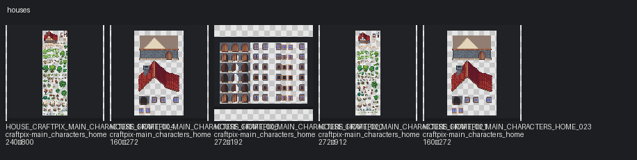

# Houses

Categories: house, building, fence, gate

## Contact sheets

## Assets

| Asset ID | Pack | Source | Size | Alpha | Status | Tags | Notes |
|---|---|---|---|---|---|---|---|
| `HOUSE_CRAFTPIX_MAIN_CHARACTERS_HOME_004` | craftpix-main_characters_home | `assets/third_party/craftpix/main_characters_home/source/PNG/exterior.png` | 240×800 | True | available | craftpix, house, outdoor | Possible 16px atlas; frame groups not inferred without TSX/JSON. |
| `HOUSE_CRAFTPIX_MAIN_CHARACTERS_HOME_006` | craftpix-main_characters_home | `assets/third_party/craftpix/main_characters_home/source/PNG/house_details.png` | 160×272 | True | available | craftpix, house, outdoor |  |
| `HOUSE_CRAFTPIX_MAIN_CHARACTERS_HOME_020` | craftpix-main_characters_home | `assets/third_party/craftpix/main_characters_home/source/Tiled_files/Doors_windows_animation.png` | 272×192 | True | available | craftpix, house, outdoor | Possible 16px atlas; frame groups not inferred without TSX/JSON. |
| `HOUSE_CRAFTPIX_MAIN_CHARACTERS_HOME_021` | craftpix-main_characters_home | `assets/third_party/craftpix/main_characters_home/source/Tiled_files/exterior.png` | 272×912 | True | available | craftpix, house, outdoor | Possible 16px atlas; frame groups not inferred without TSX/JSON. |
| `HOUSE_CRAFTPIX_MAIN_CHARACTERS_HOME_023` | craftpix-main_characters_home | `assets/third_party/craftpix/main_characters_home/source/Tiled_files/house_details.png` | 160×272 | True | available | craftpix, house, outdoor |  |
