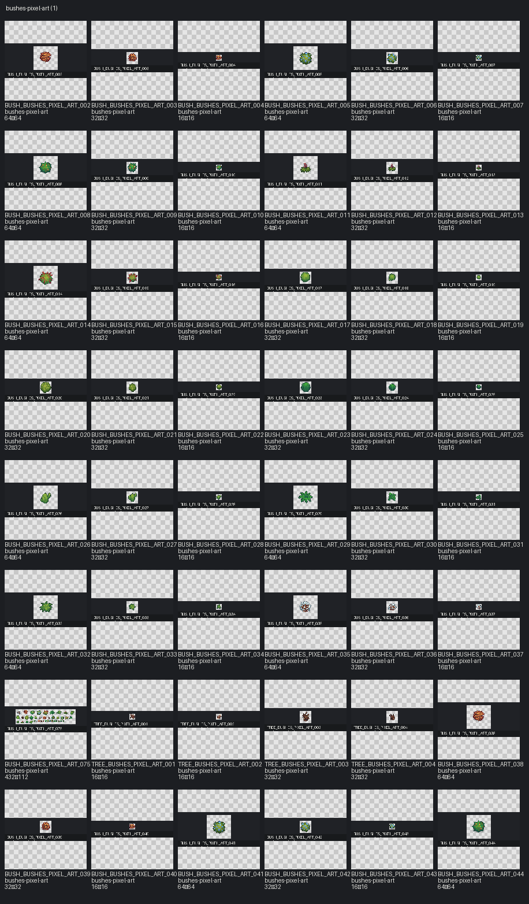

# Pack: bushes-pixel-art

[← START_HERE](../../../START_HERE.md)

- **Slug / pack_id:** `bushes-pixel-art` / `bushes-pixel-art`
- **Source folder:** `upload/bushes-pixel-art`
- **Source kind:** upload
- **Author:** CraftPix
- **License:** CraftPix freebie terms (verify per pack)
- **License URL:** https://craftpix.net/file-licenses/
- **License status:** `needs_review`
- **Files catalogued (images+meta notes):** 165
- **Categories:** bush, tree
- **Distinct image sizes:** 16×16, 32×32, 64×64, 432×112
- **GIF / animated:** 0
- **Sprite sheets:** 0
- **TMX:** —
- **TSX:** —
- **Tile size (probable):** —

## Contact sheet

## Fit for this project

- Top-down bushes — good fill for overgrown yard edges.

## Style outliers

- Bright flower bushes may read more fantasy; prefer muted greens for VS01.
- Fantasy-tagged assets: **0**

## Oversized / scale risks

- Wide bushes can block paths — keep clearances around gate/door.
- Tagged oversized: **0**

## VS01 candidates

- Strong bush candidates for left overgrown + house perimeter.
- Already selected/runtime/candidate in this pack: **0**

## Asset IDs (sample)

- `BUSH_BUSHES_PIXEL_ART_001` — `upload/bushes-pixel-art/Bushes.psd` [available]
- `BUSH_BUSHES_PIXEL_ART_002` — `upload/bushes-pixel-art/PNG/Assets/Autumn_bush1.png` [available]
- `BUSH_BUSHES_PIXEL_ART_003` — `upload/bushes-pixel-art/PNG/Assets/Autumn_bush2.png` [available]
- `BUSH_BUSHES_PIXEL_ART_004` — `upload/bushes-pixel-art/PNG/Assets/Autumn_bush3.png` [available]
- `TREE_BUSHES_PIXEL_ART_001` — `upload/bushes-pixel-art/PNG/Assets/Broken_tree1.png` [available]
- `TREE_BUSHES_PIXEL_ART_002` — `upload/bushes-pixel-art/PNG/Assets/Broken_tree2.png` [available]
- `TREE_BUSHES_PIXEL_ART_003` — `upload/bushes-pixel-art/PNG/Assets/Burned_tree1.png` [available]
- `TREE_BUSHES_PIXEL_ART_004` — `upload/bushes-pixel-art/PNG/Assets/Burned_tree2.png` [available]
- `BUSH_BUSHES_PIXEL_ART_005` — `upload/bushes-pixel-art/PNG/Assets/Bush_blue_flowers1.png` [available]
- `BUSH_BUSHES_PIXEL_ART_006` — `upload/bushes-pixel-art/PNG/Assets/Bush_blue_flowers2.png` [available]
- `BUSH_BUSHES_PIXEL_ART_007` — `upload/bushes-pixel-art/PNG/Assets/Bush_blue_flowers3.png` [available]
- `BUSH_BUSHES_PIXEL_ART_008` — `upload/bushes-pixel-art/PNG/Assets/Bush_orange_flowers1.png` [available]
- `BUSH_BUSHES_PIXEL_ART_009` — `upload/bushes-pixel-art/PNG/Assets/Bush_orange_flowers2.png` [available]
- `BUSH_BUSHES_PIXEL_ART_010` — `upload/bushes-pixel-art/PNG/Assets/Bush_orange_flowers3.png` [available]
- `BUSH_BUSHES_PIXEL_ART_011` — `upload/bushes-pixel-art/PNG/Assets/Bush_pink_flowers1.png` [available]
- `BUSH_BUSHES_PIXEL_ART_012` — `upload/bushes-pixel-art/PNG/Assets/Bush_pink_flowers2.png` [available]
- `BUSH_BUSHES_PIXEL_ART_013` — `upload/bushes-pixel-art/PNG/Assets/Bush_pink_flowers3.png` [available]
- `BUSH_BUSHES_PIXEL_ART_014` — `upload/bushes-pixel-art/PNG/Assets/Bush_red_flowers1.png` [available]
- `BUSH_BUSHES_PIXEL_ART_015` — `upload/bushes-pixel-art/PNG/Assets/Bush_red_flowers2.png` [available]
- `BUSH_BUSHES_PIXEL_ART_016` — `upload/bushes-pixel-art/PNG/Assets/Bush_red_flowers3.png` [available]
- `BUSH_BUSHES_PIXEL_ART_017` — `upload/bushes-pixel-art/PNG/Assets/Bush_simple1_1.png` [available]
- `BUSH_BUSHES_PIXEL_ART_018` — `upload/bushes-pixel-art/PNG/Assets/Bush_simple1_2.png` [available]
- `BUSH_BUSHES_PIXEL_ART_019` — `upload/bushes-pixel-art/PNG/Assets/Bush_simple1_3.png` [available]
- `BUSH_BUSHES_PIXEL_ART_020` — `upload/bushes-pixel-art/PNG/Assets/Bush_simple2_1.png` [available]
- `BUSH_BUSHES_PIXEL_ART_021` — `upload/bushes-pixel-art/PNG/Assets/Bush_simple2_2.png` [available]
- `BUSH_BUSHES_PIXEL_ART_022` — `upload/bushes-pixel-art/PNG/Assets/Bush_simple2_3.png` [available]
- `BUSH_BUSHES_PIXEL_ART_023` — `upload/bushes-pixel-art/PNG/Assets/Cactus1_1.png` [available]
- `BUSH_BUSHES_PIXEL_ART_024` — `upload/bushes-pixel-art/PNG/Assets/Cactus1_2.png` [available]
- `BUSH_BUSHES_PIXEL_ART_025` — `upload/bushes-pixel-art/PNG/Assets/Cactus1_3.png` [available]
- `BUSH_BUSHES_PIXEL_ART_026` — `upload/bushes-pixel-art/PNG/Assets/Cactus2_1.png` [available]
- `BUSH_BUSHES_PIXEL_ART_027` — `upload/bushes-pixel-art/PNG/Assets/Cactus2_2.png` [available]
- `BUSH_BUSHES_PIXEL_ART_028` — `upload/bushes-pixel-art/PNG/Assets/Cactus2_3.png` [available]
- `BUSH_BUSHES_PIXEL_ART_029` — `upload/bushes-pixel-art/PNG/Assets/Fern1_1.png` [available]
- `BUSH_BUSHES_PIXEL_ART_030` — `upload/bushes-pixel-art/PNG/Assets/Fern1_2.png` [available]
- `BUSH_BUSHES_PIXEL_ART_031` — `upload/bushes-pixel-art/PNG/Assets/Fern1_3.png` [available]
- `BUSH_BUSHES_PIXEL_ART_032` — `upload/bushes-pixel-art/PNG/Assets/Fern2_1.png` [available]
- `BUSH_BUSHES_PIXEL_ART_033` — `upload/bushes-pixel-art/PNG/Assets/Fern2_2.png` [available]
- `BUSH_BUSHES_PIXEL_ART_034` — `upload/bushes-pixel-art/PNG/Assets/Fern2_3.png` [available]
- `BUSH_BUSHES_PIXEL_ART_035` — `upload/bushes-pixel-art/PNG/Assets/Snow_bush1.png` [available]
- `BUSH_BUSHES_PIXEL_ART_036` — `upload/bushes-pixel-art/PNG/Assets/Snow_bush2.png` [available]
- … +125 more (see category pages / `asset_catalog.json`)
