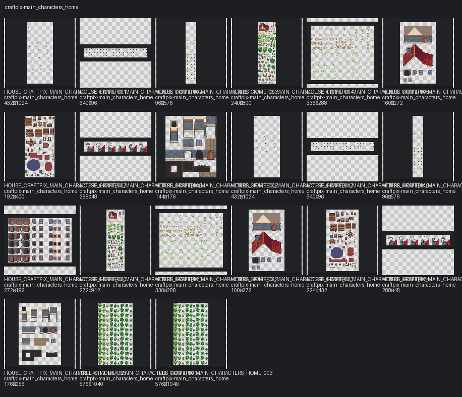

# Pack: craftpix-main_characters_home

- **Slug:** `craftpix-main-characters-home`
- **Source folder:** `assets/third_party/craftpix/main_characters_home`
- **Source kind:** third_party
- **Author:** CraftPix
- **License:** CraftPix freebie terms
- **License URL:** https://craftpix.net/file-licenses/
- **License status:** `reviewed`
- **Added (catalog):** 2026-08-01
- **Image assets:** 21
- **Categories:** animal, effect, house, interior, terrain, tree
- **Distinct sizes:** 96×576, 144×176, 160×272, 176×256, 192×400, 224×432, 240×800, 272×192, 272×912, 288×48, 336×288, 432×1024, 576×1040, 640×96
- **Sprite sheets:** 17
- **Tiled files:** —

## Contact sheet

## Fit for this project

- Top-down CraftPix-style packs generally match the outdoor direction under evaluation.
- Prefer separate object PNGs over huge sheets when placing yard props.
- Shadow / texture_shadow variants are tagged; use deliberately.

## Style / prep notes

- Confirm license + Git storage before promoting to `status=runtime`.
- Do not auto-copy into `assets/third_party/` until explicitly selected.
- Scale lock remains 16×16 world grid; measure each asset before wiring collisions/Y-sort.

## Asset IDs (sample)

- `HOUSE_CRAFTPIX_MAIN_CHARACTERS_HOME_001` — `assets/third_party/craftpix/main_characters_home/source/PNG/bird_fly_animation.png`
- `HOUSE_CRAFTPIX_MAIN_CHARACTERS_HOME_002` — `assets/third_party/craftpix/main_characters_home/source/PNG/bird_jump_animation.png`
- `HOUSE_CRAFTPIX_MAIN_CHARACTERS_HOME_003` — `assets/third_party/craftpix/main_characters_home/source/PNG/cat_animation.png`
- `HOUSE_CRAFTPIX_MAIN_CHARACTERS_HOME_004` — `assets/third_party/craftpix/main_characters_home/source/PNG/exterior.png`
- `HOUSE_CRAFTPIX_MAIN_CHARACTERS_HOME_005` — `assets/third_party/craftpix/main_characters_home/source/PNG/ground_grass_details.png`
- `HOUSE_CRAFTPIX_MAIN_CHARACTERS_HOME_006` — `assets/third_party/craftpix/main_characters_home/source/PNG/house_details.png`
- `HOUSE_CRAFTPIX_MAIN_CHARACTERS_HOME_007` — `assets/third_party/craftpix/main_characters_home/source/PNG/Interior.png`
- `HOUSE_CRAFTPIX_MAIN_CHARACTERS_HOME_008` — `assets/third_party/craftpix/main_characters_home/source/PNG/Smoke_animation.png`
- `TREE_CRAFTPIX_MAIN_CHARACTERS_HOME_001` — `assets/third_party/craftpix/main_characters_home/source/PNG/Trees_animation.png`
- `HOUSE_CRAFTPIX_MAIN_CHARACTERS_HOME_009` — `assets/third_party/craftpix/main_characters_home/source/PNG/walls_floor.png`
- `HOUSE_CRAFTPIX_MAIN_CHARACTERS_HOME_010` — `assets/third_party/craftpix/main_characters_home/source/PSD/bird_fly_animation.psd`
- `HOUSE_CRAFTPIX_MAIN_CHARACTERS_HOME_011` — `assets/third_party/craftpix/main_characters_home/source/PSD/bird_jump_animation.psd`
- `HOUSE_CRAFTPIX_MAIN_CHARACTERS_HOME_012` — `assets/third_party/craftpix/main_characters_home/source/PSD/cat_animation.psd`
- `HOUSE_CRAFTPIX_MAIN_CHARACTERS_HOME_013` — `assets/third_party/craftpix/main_characters_home/source/PSD/exterior.psd`
- `HOUSE_CRAFTPIX_MAIN_CHARACTERS_HOME_014` — `assets/third_party/craftpix/main_characters_home/source/PSD/ground_grass_details.psd`
- `HOUSE_CRAFTPIX_MAIN_CHARACTERS_HOME_015` — `assets/third_party/craftpix/main_characters_home/source/PSD/Interior.psd`
- `TREE_CRAFTPIX_MAIN_CHARACTERS_HOME_002` — `assets/third_party/craftpix/main_characters_home/source/PSD/Trees_animation.psd`
- `HOUSE_CRAFTPIX_MAIN_CHARACTERS_HOME_016` — `assets/third_party/craftpix/main_characters_home/source/PSD/walls_floor.psd`
- `HOUSE_CRAFTPIX_MAIN_CHARACTERS_HOME_017` — `assets/third_party/craftpix/main_characters_home/source/Tiled_files/bird_fly_animation.png`
- `HOUSE_CRAFTPIX_MAIN_CHARACTERS_HOME_018` — `assets/third_party/craftpix/main_characters_home/source/Tiled_files/bird_jump_animation.png`
- `HOUSE_CRAFTPIX_MAIN_CHARACTERS_HOME_019` — `assets/third_party/craftpix/main_characters_home/source/Tiled_files/cat_animation.png`
- `HOUSE_CRAFTPIX_MAIN_CHARACTERS_HOME_020` — `assets/third_party/craftpix/main_characters_home/source/Tiled_files/Doors_windows_animation.png`
- `HOUSE_CRAFTPIX_MAIN_CHARACTERS_HOME_021` — `assets/third_party/craftpix/main_characters_home/source/Tiled_files/exterior.png`
- `HOUSE_CRAFTPIX_MAIN_CHARACTERS_HOME_022` — `assets/third_party/craftpix/main_characters_home/source/Tiled_files/ground_grass_details.png`
- `HOUSE_CRAFTPIX_MAIN_CHARACTERS_HOME_023` — `assets/third_party/craftpix/main_characters_home/source/Tiled_files/house_details.png`
- … +4 more (see category pages / `asset_catalog.json`)
