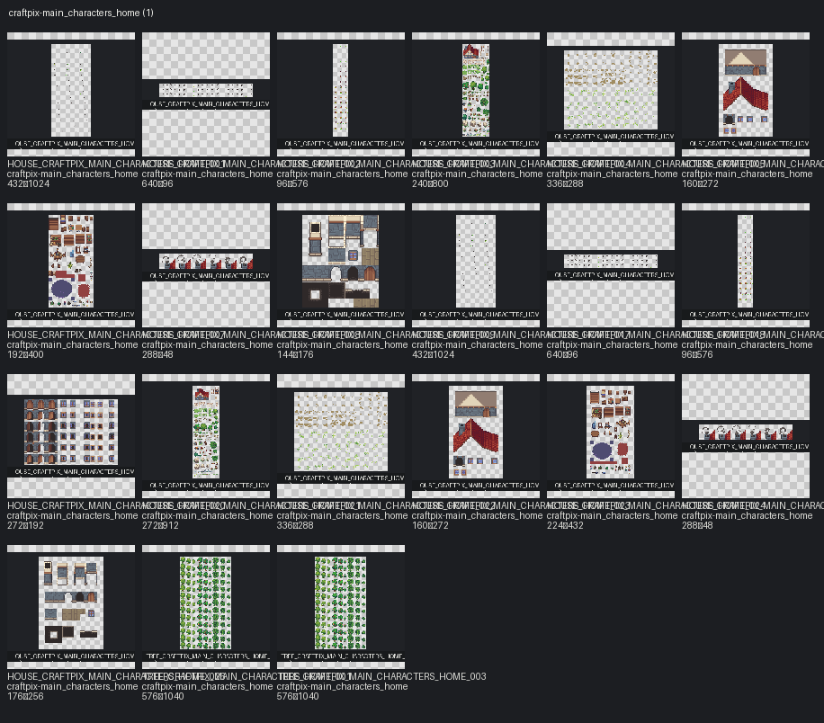

# Pack: craftpix-main_characters_home

[← Каталог ассетов](../../../../../README.md#где-смотреть-ассеты)

- **Slug / pack_id:** `craftpix-main-characters-home` / `craftpix-main_characters_home`
- **Source folder:** `assets/third_party/craftpix/main_characters_home`
- **Source kind:** third_party
- **Author:** CraftPix
- **License:** CraftPix freebie terms
- **License URL:** https://craftpix.net/file-licenses/
- **License status:** `reviewed`
- **Files catalogued (images+meta notes):** 29
- **Categories:** animal, effect, house, interior, terrain, tree
- **Distinct image sizes:** 96×576, 144×176, 160×272, 176×256, 192×400, 224×432, 240×800, 272×192, 272×912, 288×48, 336×288, 432×1024, 576×1040, 640×96
- **GIF / animated:** 0
- **Sprite sheets:** 17
- **TMX:** —
- **TSX:** —
- **Tile size (probable):** 16

## Contact sheet

## Fit for this project

- CraftPix cottage kit — useful for props/fence reference; not the VS01 primary house.

## Style outliers

- Cute fantasy cottage look; giant decorative mushrooms in exterior demos are fantasy_like / oversized for VS01.
- Fantasy-tagged assets: **6**

## Oversized / scale risks

- Giant mushrooms and fairy-scale props — catalogued but rejected for VS01 yard anchors.
- Tagged oversized: **4**

## VS01 candidates

- Do not use as main house. Prefer HOUSE_MAIN_HOUSE_V1. Props may be candidates after scale check.
- Already selected/runtime/candidate in this pack: **0**

## Asset IDs (sample)

- `HOUSE_CRAFTPIX_MAIN_CHARACTERS_HOME_001` — `assets/third_party/craftpix/main_characters_home/source/PNG/bird_fly_animation.png` [available]
- `HOUSE_CRAFTPIX_MAIN_CHARACTERS_HOME_002` — `assets/third_party/craftpix/main_characters_home/source/PNG/bird_jump_animation.png` [available]
- `HOUSE_CRAFTPIX_MAIN_CHARACTERS_HOME_003` — `assets/third_party/craftpix/main_characters_home/source/PNG/cat_animation.png` [available]
- `HOUSE_CRAFTPIX_MAIN_CHARACTERS_HOME_004` — `assets/third_party/craftpix/main_characters_home/source/PNG/exterior.png` [needs_review]
- `HOUSE_CRAFTPIX_MAIN_CHARACTERS_HOME_005` — `assets/third_party/craftpix/main_characters_home/source/PNG/ground_grass_details.png` [available]
- `HOUSE_CRAFTPIX_MAIN_CHARACTERS_HOME_006` — `assets/third_party/craftpix/main_characters_home/source/PNG/house_details.png` [available]
- `HOUSE_CRAFTPIX_MAIN_CHARACTERS_HOME_007` — `assets/third_party/craftpix/main_characters_home/source/PNG/Interior.png` [available]
- `HOUSE_CRAFTPIX_MAIN_CHARACTERS_HOME_008` — `assets/third_party/craftpix/main_characters_home/source/PNG/Smoke_animation.png` [available]
- `TREE_CRAFTPIX_MAIN_CHARACTERS_HOME_001` — `assets/third_party/craftpix/main_characters_home/source/PNG/Trees_animation.png` [needs_review]
- `HOUSE_CRAFTPIX_MAIN_CHARACTERS_HOME_009` — `assets/third_party/craftpix/main_characters_home/source/PNG/walls_floor.png` [available]
- `HOUSE_CRAFTPIX_MAIN_CHARACTERS_HOME_010` — `assets/third_party/craftpix/main_characters_home/source/PSD/bird_fly_animation.psd` [available]
- `HOUSE_CRAFTPIX_MAIN_CHARACTERS_HOME_011` — `assets/third_party/craftpix/main_characters_home/source/PSD/bird_jump_animation.psd` [available]
- `HOUSE_CRAFTPIX_MAIN_CHARACTERS_HOME_012` — `assets/third_party/craftpix/main_characters_home/source/PSD/cat_animation.psd` [available]
- `HOUSE_CRAFTPIX_MAIN_CHARACTERS_HOME_013` — `assets/third_party/craftpix/main_characters_home/source/PSD/exterior.psd` [needs_review]
- `HOUSE_CRAFTPIX_MAIN_CHARACTERS_HOME_014` — `assets/third_party/craftpix/main_characters_home/source/PSD/ground_grass_details.psd` [available]
- `HOUSE_CRAFTPIX_MAIN_CHARACTERS_HOME_015` — `assets/third_party/craftpix/main_characters_home/source/PSD/Interior.psd` [available]
- `TREE_CRAFTPIX_MAIN_CHARACTERS_HOME_002` — `assets/third_party/craftpix/main_characters_home/source/PSD/Trees_animation.psd` [needs_review]
- `HOUSE_CRAFTPIX_MAIN_CHARACTERS_HOME_016` — `assets/third_party/craftpix/main_characters_home/source/PSD/walls_floor.psd` [available]
- `HOUSE_CRAFTPIX_MAIN_CHARACTERS_HOME_017` — `assets/third_party/craftpix/main_characters_home/source/Tiled_files/bird_fly_animation.png` [available]
- `HOUSE_CRAFTPIX_MAIN_CHARACTERS_HOME_018` — `assets/third_party/craftpix/main_characters_home/source/Tiled_files/bird_jump_animation.png` [available]
- `HOUSE_CRAFTPIX_MAIN_CHARACTERS_HOME_019` — `assets/third_party/craftpix/main_characters_home/source/Tiled_files/cat_animation.png` [available]
- `HOUSE_CRAFTPIX_MAIN_CHARACTERS_HOME_020` — `assets/third_party/craftpix/main_characters_home/source/Tiled_files/Doors_windows_animation.png` [available]
- `HOUSE_CRAFTPIX_MAIN_CHARACTERS_HOME_021` — `assets/third_party/craftpix/main_characters_home/source/Tiled_files/exterior.png` [needs_review]
- `HOUSE_CRAFTPIX_MAIN_CHARACTERS_HOME_022` — `assets/third_party/craftpix/main_characters_home/source/Tiled_files/ground_grass_details.png` [available]
- `HOUSE_CRAFTPIX_MAIN_CHARACTERS_HOME_023` — `assets/third_party/craftpix/main_characters_home/source/Tiled_files/house_details.png` [available]
- `HOUSE_CRAFTPIX_MAIN_CHARACTERS_HOME_024` — `assets/third_party/craftpix/main_characters_home/source/Tiled_files/Interior.png` [available]
- `HOUSE_CRAFTPIX_MAIN_CHARACTERS_HOME_025` — `assets/third_party/craftpix/main_characters_home/source/Tiled_files/Smoke_animation.png` [available]
- `TREE_CRAFTPIX_MAIN_CHARACTERS_HOME_003` — `assets/third_party/craftpix/main_characters_home/source/Tiled_files/Trees_animation.png` [needs_review]
- `HOUSE_CRAFTPIX_MAIN_CHARACTERS_HOME_026` — `assets/third_party/craftpix/main_characters_home/source/Tiled_files/walls_floor.png` [available]
