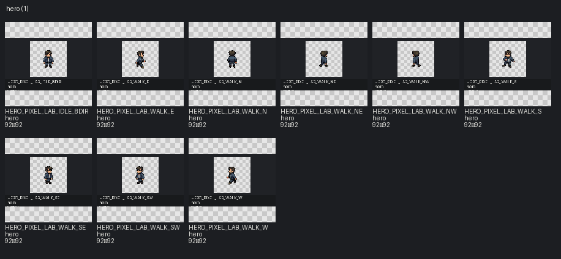

# Pack: hero

[← START_HERE](../../../START_HERE.md)

- **Slug / pack_id:** `hero` / `hero`
- **Source folder:** `upload/hero`
- **Source kind:** upload
- **Author:** PixelLab (generated)
- **License:** project-owned generation — confirm redistribution terms
- **License URL:** None
- **License status:** `needs_review`
- **Files catalogued (images+meta notes):** 9
- **Categories:** hero
- **Distinct image sizes:** 92×92
- **GIF / animated:** 9
- **Sprite sheets:** 0
- **TMX:** —
- **TSX:** —
- **Tile size (probable):** —

## Contact sheet

## Fit for this project

- PixelLab 8-dir idle + walk GIFs — current player candidate/runtime.

## Style outliers

- Source GIFs are large canvas; runtime uses integer nearest PIXEL_DIV.
- Fantasy-tagged assets: **0**

## Oversized / scale risks

- Do not place at native GIF canvas size in world — use prepared runtime frames.
- Tagged oversized: **0**

## VS01 candidates

- Selected for player integration (runtime under assets/characters/player/pixellab_v1/).
- Already selected/runtime/candidate in this pack: **9**

## Asset IDs (sample)

- `HERO_PIXEL_LAB_IDLE_8DIR` — `upload/hero/Idle_rotations_8dir.gif` [runtime]
- `HERO_PIXEL_LAB_WALK_E` — `upload/hero/Idle_v3_walking_east.gif` [runtime]
- `HERO_PIXEL_LAB_WALK_NE` — `upload/hero/Idle_v3_walking_north-east.gif` [runtime]
- `HERO_PIXEL_LAB_WALK_NW` — `upload/hero/Idle_v3_walking_north-west.gif` [runtime]
- `HERO_PIXEL_LAB_WALK_N` — `upload/hero/Idle_v3_walking_north.gif` [runtime]
- `HERO_PIXEL_LAB_WALK_SE` — `upload/hero/Idle_v3_walking_south-east.gif` [runtime]
- `HERO_PIXEL_LAB_WALK_SW` — `upload/hero/Idle_v3_walking_south-west.gif` [runtime]
- `HERO_PIXEL_LAB_WALK_S` — `upload/hero/Idle_v3_walking_south.gif` [runtime]
- `HERO_PIXEL_LAB_WALK_W` — `upload/hero/Idle_v3_walking_west.gif` [runtime]
