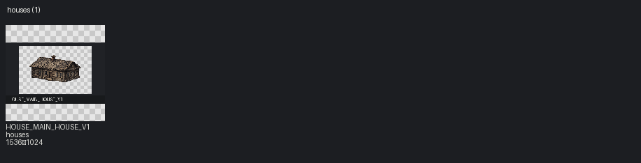

# Pack: houses

[← Каталог ассетов](../../../../../README.md#где-смотреть-ассеты)

- **Slug / pack_id:** `houses` / `houses`
- **Source folder:** `upload/houses`
- **Source kind:** upload
- **Author:** project / owner-provided
- **License:** project asset
- **License URL:** None
- **License status:** `reviewed`
- **Files catalogued (images+meta notes):** 1
- **Categories:** house
- **Distinct image sizes:** 1536×1024
- **GIF / animated:** 0
- **Sprite sheets:** 1
- **TMX:** —
- **TSX:** —
- **Tile size (probable):** 16

## Contact sheet

## Fit for this project

- Approved childhood-home exterior source folder.

## Style outliers

- Source PNG may include solid black background — keyed at bake time.
- Fantasy-tagged assets: **0**

## Oversized / scale risks

- Source 1536×1024; runtime uses ÷4 nearest after crop.
- Tagged oversized: **0**

## VS01 candidates

- HOUSE_MAIN_HOUSE_V1 is the selected starting house.
- Already selected/runtime/candidate in this pack: **1**

## Asset IDs (sample)

- `HOUSE_MAIN_HOUSE_V1` — `upload/houses/main_house_v1.png` [selected]
