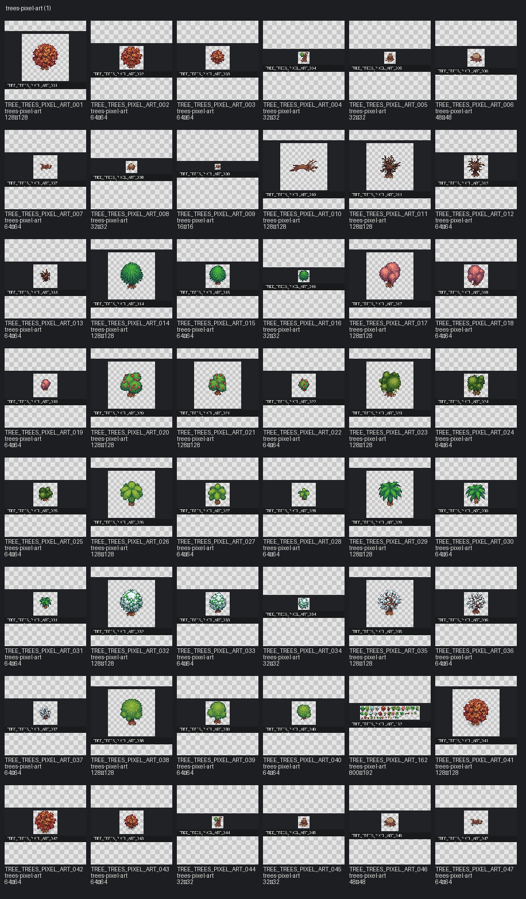

# Pack: trees-pixel-art

[← START_HERE](../../../START_HERE.md)

- **Slug / pack_id:** `trees-pixel-art` / `trees-pixel-art`
- **Source folder:** `upload/trees-pixel-art`
- **Source kind:** upload
- **Author:** CraftPix
- **License:** CraftPix freebie terms (verify per pack)
- **License URL:** https://craftpix.net/file-licenses/
- **License status:** `needs_review`
- **Files catalogued (images+meta notes):** 165
- **Categories:** tree
- **Distinct image sizes:** 16×16, 32×32, 48×48, 64×64, 128×128, 800×192
- **GIF / animated:** 0
- **Sprite sheets:** 4
- **TMX:** —
- **TSX:** —
- **Tile size (probable):** 16

## Contact sheet

## Fit for this project

- Top-down pixel trees — strong outdoor vegetation candidates for yard borders.

## Style outliers

- Seasonal / christmas / burned variants may look thematic; pick deliberately.
- Fantasy-tagged assets: **0**

## Oversized / scale risks

- Very tall canopy sprites need Y-sort + footprint check vs hero (~23px display).
- Tagged oversized: **4**

## VS01 candidates

- Primary tree candidates for north/left overgrown zones after owner ID selection.
- Already selected/runtime/candidate in this pack: **0**

## Asset IDs (sample)

- `TREE_TREES_PIXEL_ART_001` — `upload/trees-pixel-art/PNG/Assets_separately/Trees/Autumn_tree1.png` [available]
- `TREE_TREES_PIXEL_ART_002` — `upload/trees-pixel-art/PNG/Assets_separately/Trees/Autumn_tree2.png` [available]
- `TREE_TREES_PIXEL_ART_003` — `upload/trees-pixel-art/PNG/Assets_separately/Trees/Autumn_tree3.png` [available]
- `TREE_TREES_PIXEL_ART_004` — `upload/trees-pixel-art/PNG/Assets_separately/Trees/Broken_tree1.png` [available]
- `TREE_TREES_PIXEL_ART_005` — `upload/trees-pixel-art/PNG/Assets_separately/Trees/Broken_tree2.png` [available]
- `TREE_TREES_PIXEL_ART_006` — `upload/trees-pixel-art/PNG/Assets_separately/Trees/Broken_tree3.png` [available]
- `TREE_TREES_PIXEL_ART_007` — `upload/trees-pixel-art/PNG/Assets_separately/Trees/Broken_tree4.png` [available]
- `TREE_TREES_PIXEL_ART_008` — `upload/trees-pixel-art/PNG/Assets_separately/Trees/Broken_tree5.png` [available]
- `TREE_TREES_PIXEL_ART_009` — `upload/trees-pixel-art/PNG/Assets_separately/Trees/Broken_tree6.png` [available]
- `TREE_TREES_PIXEL_ART_010` — `upload/trees-pixel-art/PNG/Assets_separately/Trees/Broken_tree7.png` [available]
- `TREE_TREES_PIXEL_ART_011` — `upload/trees-pixel-art/PNG/Assets_separately/Trees/Burned_tree1.png` [available]
- `TREE_TREES_PIXEL_ART_012` — `upload/trees-pixel-art/PNG/Assets_separately/Trees/Burned_tree2.png` [available]
- `TREE_TREES_PIXEL_ART_013` — `upload/trees-pixel-art/PNG/Assets_separately/Trees/Burned_tree3.png` [available]
- `TREE_TREES_PIXEL_ART_014` — `upload/trees-pixel-art/PNG/Assets_separately/Trees/Christmas_tree1.png` [available]
- `TREE_TREES_PIXEL_ART_015` — `upload/trees-pixel-art/PNG/Assets_separately/Trees/Christmas_tree2.png` [available]
- `TREE_TREES_PIXEL_ART_016` — `upload/trees-pixel-art/PNG/Assets_separately/Trees/Christmas_tree3.png` [available]
- `TREE_TREES_PIXEL_ART_017` — `upload/trees-pixel-art/PNG/Assets_separately/Trees/Flower_tree1.png` [available]
- `TREE_TREES_PIXEL_ART_018` — `upload/trees-pixel-art/PNG/Assets_separately/Trees/Flower_tree2.png` [available]
- `TREE_TREES_PIXEL_ART_019` — `upload/trees-pixel-art/PNG/Assets_separately/Trees/Flower_tree3.png` [available]
- `TREE_TREES_PIXEL_ART_020` — `upload/trees-pixel-art/PNG/Assets_separately/Trees/Fruit_tree1.png` [available]
- `TREE_TREES_PIXEL_ART_021` — `upload/trees-pixel-art/PNG/Assets_separately/Trees/Fruit_tree2.png` [available]
- `TREE_TREES_PIXEL_ART_022` — `upload/trees-pixel-art/PNG/Assets_separately/Trees/Fruit_tree3.png` [available]
- `TREE_TREES_PIXEL_ART_023` — `upload/trees-pixel-art/PNG/Assets_separately/Trees/Moss_tree1.png` [available]
- `TREE_TREES_PIXEL_ART_024` — `upload/trees-pixel-art/PNG/Assets_separately/Trees/Moss_tree2.png` [available]
- `TREE_TREES_PIXEL_ART_025` — `upload/trees-pixel-art/PNG/Assets_separately/Trees/Moss_tree3.png` [available]
- `TREE_TREES_PIXEL_ART_026` — `upload/trees-pixel-art/PNG/Assets_separately/Trees/Palm_tree1_1.png` [available]
- `TREE_TREES_PIXEL_ART_027` — `upload/trees-pixel-art/PNG/Assets_separately/Trees/Palm_tree1_2.png` [available]
- `TREE_TREES_PIXEL_ART_028` — `upload/trees-pixel-art/PNG/Assets_separately/Trees/Palm_tree1_3.png` [available]
- `TREE_TREES_PIXEL_ART_029` — `upload/trees-pixel-art/PNG/Assets_separately/Trees/Palm_tree2_1.png` [available]
- `TREE_TREES_PIXEL_ART_030` — `upload/trees-pixel-art/PNG/Assets_separately/Trees/Palm_tree2_2.png` [available]
- `TREE_TREES_PIXEL_ART_031` — `upload/trees-pixel-art/PNG/Assets_separately/Trees/Palm_tree2_3.png` [available]
- `TREE_TREES_PIXEL_ART_032` — `upload/trees-pixel-art/PNG/Assets_separately/Trees/Snow_christmass_tree1.png` [available]
- `TREE_TREES_PIXEL_ART_033` — `upload/trees-pixel-art/PNG/Assets_separately/Trees/Snow_christmass_tree2.png` [available]
- `TREE_TREES_PIXEL_ART_034` — `upload/trees-pixel-art/PNG/Assets_separately/Trees/Snow_christmass_tree3.png` [available]
- `TREE_TREES_PIXEL_ART_035` — `upload/trees-pixel-art/PNG/Assets_separately/Trees/Snow_tree1.png` [available]
- `TREE_TREES_PIXEL_ART_036` — `upload/trees-pixel-art/PNG/Assets_separately/Trees/Snow_tree2.png` [available]
- `TREE_TREES_PIXEL_ART_037` — `upload/trees-pixel-art/PNG/Assets_separately/Trees/Snow_tree3.png` [available]
- `TREE_TREES_PIXEL_ART_038` — `upload/trees-pixel-art/PNG/Assets_separately/Trees/Tree1.png` [available]
- `TREE_TREES_PIXEL_ART_039` — `upload/trees-pixel-art/PNG/Assets_separately/Trees/Tree2.png` [available]
- `TREE_TREES_PIXEL_ART_040` — `upload/trees-pixel-art/PNG/Assets_separately/Trees/Tree3.png` [available]
- … +125 more (see category pages / `asset_catalog.json`)
