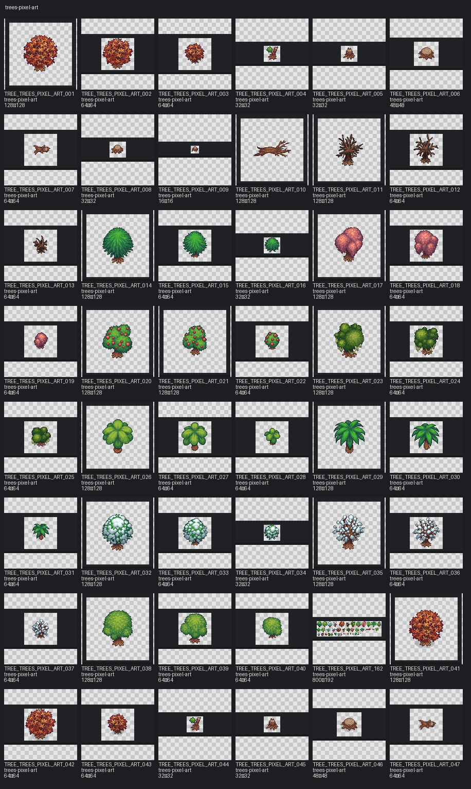

# Pack: trees-pixel-art

- **Slug:** `trees-pixel-art`
- **Source folder:** `upload/trees-pixel-art`
- **Source kind:** upload
- **Author:** CraftPix
- **License:** CraftPix freebie terms (verify per pack)
- **License URL:** https://craftpix.net/file-licenses/
- **License status:** `needs_review`
- **Added (catalog):** 2026-08-01
- **Image assets:** 164
- **Categories:** tree
- **Distinct sizes:** 16×16, 32×32, 48×48, 64×64, 128×128, 800×192
- **Sprite sheets:** 4
- **Tiled files:** —

## Contact sheet

## Fit for this project

- Top-down CraftPix-style packs generally match the outdoor direction under evaluation.
- Prefer separate object PNGs over huge sheets when placing yard props.
- Shadow / texture_shadow variants are tagged; use deliberately.

## Style / prep notes

- Confirm license + Git storage before promoting to `status=runtime`.
- Do not auto-copy into `assets/third_party/` until explicitly selected.
- Scale lock remains 16×16 world grid; measure each asset before wiring collisions/Y-sort.

## Asset IDs (sample)

- `TREE_TREES_PIXEL_ART_001` — `upload/trees-pixel-art/PNG/Assets_separately/Trees/Autumn_tree1.png`
- `TREE_TREES_PIXEL_ART_002` — `upload/trees-pixel-art/PNG/Assets_separately/Trees/Autumn_tree2.png`
- `TREE_TREES_PIXEL_ART_003` — `upload/trees-pixel-art/PNG/Assets_separately/Trees/Autumn_tree3.png`
- `TREE_TREES_PIXEL_ART_004` — `upload/trees-pixel-art/PNG/Assets_separately/Trees/Broken_tree1.png`
- `TREE_TREES_PIXEL_ART_005` — `upload/trees-pixel-art/PNG/Assets_separately/Trees/Broken_tree2.png`
- `TREE_TREES_PIXEL_ART_006` — `upload/trees-pixel-art/PNG/Assets_separately/Trees/Broken_tree3.png`
- `TREE_TREES_PIXEL_ART_007` — `upload/trees-pixel-art/PNG/Assets_separately/Trees/Broken_tree4.png`
- `TREE_TREES_PIXEL_ART_008` — `upload/trees-pixel-art/PNG/Assets_separately/Trees/Broken_tree5.png`
- `TREE_TREES_PIXEL_ART_009` — `upload/trees-pixel-art/PNG/Assets_separately/Trees/Broken_tree6.png`
- `TREE_TREES_PIXEL_ART_010` — `upload/trees-pixel-art/PNG/Assets_separately/Trees/Broken_tree7.png`
- `TREE_TREES_PIXEL_ART_011` — `upload/trees-pixel-art/PNG/Assets_separately/Trees/Burned_tree1.png`
- `TREE_TREES_PIXEL_ART_012` — `upload/trees-pixel-art/PNG/Assets_separately/Trees/Burned_tree2.png`
- `TREE_TREES_PIXEL_ART_013` — `upload/trees-pixel-art/PNG/Assets_separately/Trees/Burned_tree3.png`
- `TREE_TREES_PIXEL_ART_014` — `upload/trees-pixel-art/PNG/Assets_separately/Trees/Christmas_tree1.png`
- `TREE_TREES_PIXEL_ART_015` — `upload/trees-pixel-art/PNG/Assets_separately/Trees/Christmas_tree2.png`
- `TREE_TREES_PIXEL_ART_016` — `upload/trees-pixel-art/PNG/Assets_separately/Trees/Christmas_tree3.png`
- `TREE_TREES_PIXEL_ART_017` — `upload/trees-pixel-art/PNG/Assets_separately/Trees/Flower_tree1.png`
- `TREE_TREES_PIXEL_ART_018` — `upload/trees-pixel-art/PNG/Assets_separately/Trees/Flower_tree2.png`
- `TREE_TREES_PIXEL_ART_019` — `upload/trees-pixel-art/PNG/Assets_separately/Trees/Flower_tree3.png`
- `TREE_TREES_PIXEL_ART_020` — `upload/trees-pixel-art/PNG/Assets_separately/Trees/Fruit_tree1.png`
- `TREE_TREES_PIXEL_ART_021` — `upload/trees-pixel-art/PNG/Assets_separately/Trees/Fruit_tree2.png`
- `TREE_TREES_PIXEL_ART_022` — `upload/trees-pixel-art/PNG/Assets_separately/Trees/Fruit_tree3.png`
- `TREE_TREES_PIXEL_ART_023` — `upload/trees-pixel-art/PNG/Assets_separately/Trees/Moss_tree1.png`
- `TREE_TREES_PIXEL_ART_024` — `upload/trees-pixel-art/PNG/Assets_separately/Trees/Moss_tree2.png`
- `TREE_TREES_PIXEL_ART_025` — `upload/trees-pixel-art/PNG/Assets_separately/Trees/Moss_tree3.png`
- … +140 more (see category pages / `asset_catalog.json`)
