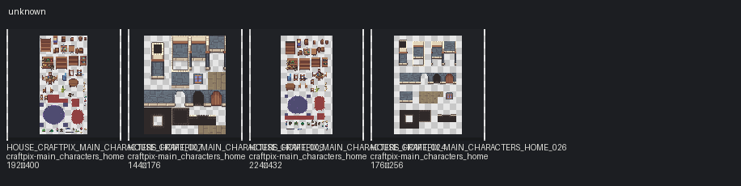

# Unknown

Categories: unknown, interior

## Contact sheets

## Assets

| Asset ID | Pack | Source | Size | Alpha | Status | Tags | Notes |
|---|---|---|---|---|---|---|---|
| `HOUSE_CRAFTPIX_MAIN_CHARACTERS_HOME_007` | craftpix-main_characters_home | `assets/third_party/craftpix/main_characters_home/source/PNG/Interior.png` | 192×400 | True | available | interior, craftpix | Possible 16px atlas; frame groups not inferred without TSX/JSON. |
| `HOUSE_CRAFTPIX_MAIN_CHARACTERS_HOME_009` | craftpix-main_characters_home | `assets/third_party/craftpix/main_characters_home/source/PNG/walls_floor.png` | 144×176 | True | available | interior, craftpix |  |
| `HOUSE_CRAFTPIX_MAIN_CHARACTERS_HOME_024` | craftpix-main_characters_home | `assets/third_party/craftpix/main_characters_home/source/Tiled_files/Interior.png` | 224×432 | True | available | interior, craftpix | Possible 16px atlas; frame groups not inferred without TSX/JSON. |
| `HOUSE_CRAFTPIX_MAIN_CHARACTERS_HOME_026` | craftpix-main_characters_home | `assets/third_party/craftpix/main_characters_home/source/Tiled_files/walls_floor.png` | 176×256 | True | available | interior, craftpix |  |
